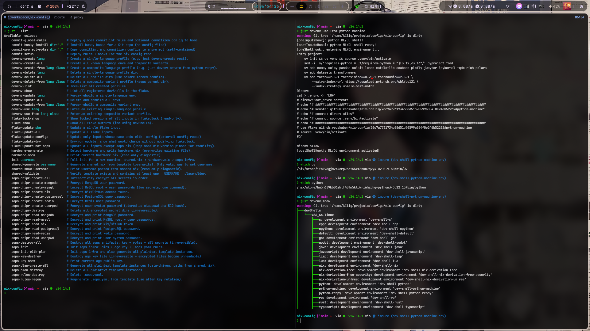
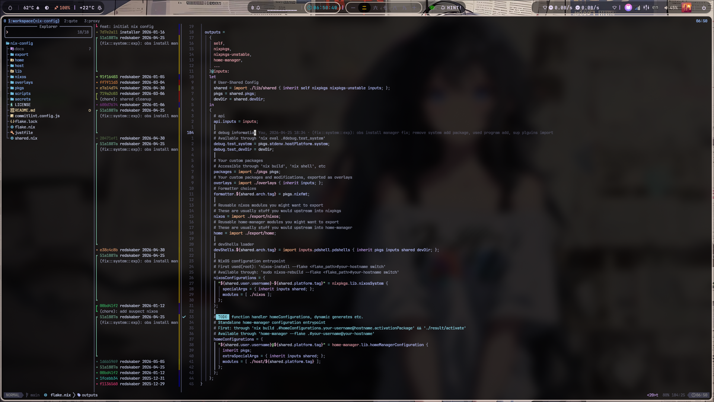
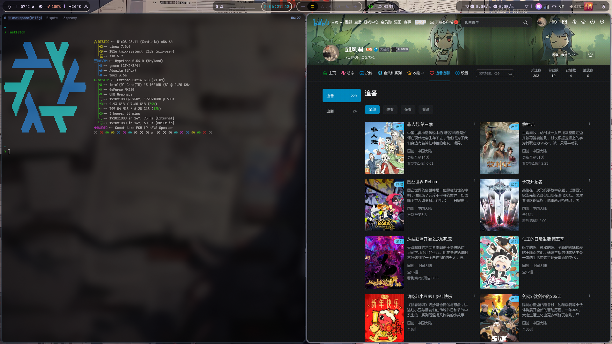
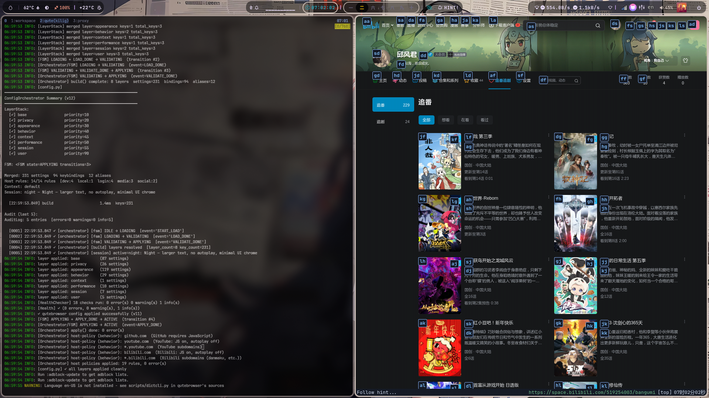
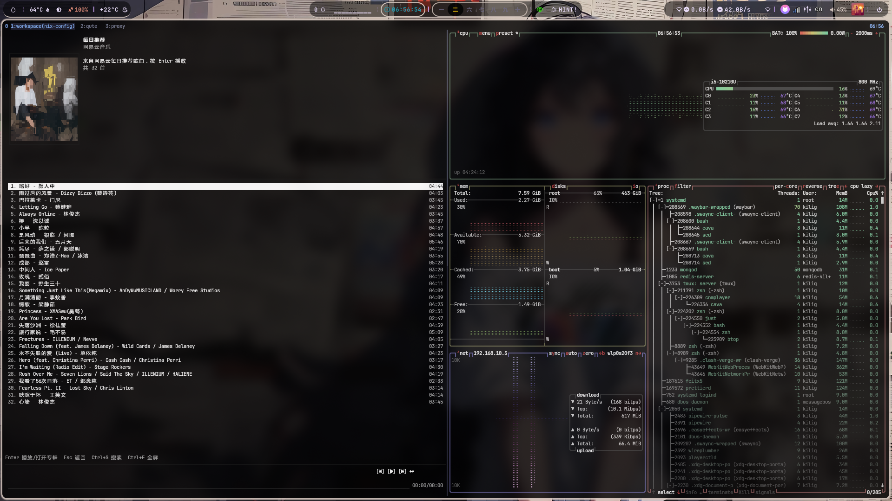

# nix-config

> 声明式、可复现、多平台的系统与开发环境管理
>
> 作者: [@Redskaber](https://github.com/Redskaber) · 构建于 Nix Flakes + Home Manager + SOPS-Nix

---

## 目录

1. [预览](#预览)
2. [架构总览](#架构总览)
3. [设计原则](#设计原则)
4. [目录结构](#目录结构)
5. [核心机制](#核心机制)
   - [1. 共享层 — 两阶段初始化](#1-共享层--两阶段初始化)
   - [2. 策略层 — shared.nix 生成机制](#2-策略层--sharednix-生成机制)
   - [3. 开发环境管道 — pdshell](#3-开发环境管道--pdshell)
   - [4. 安全层 — SOPS + Age](#4-安全层--sops--age分层管理)
   - [5. 配置编排器 — orc](#5-配置编排器--orcconfigurationorchestrator)
   - [6. 用户环境层 — home/env](#6-用户环境层--homeenv)
   - [7. 外部配置仓库](#7-外部配置仓库flakefalse-inputs)
   - [8. 提交规范](#8-提交规范--husky--commitlint--commitizen零-node_modules)
6. [CI/CD 完整执行流](#cicd-完整执行流)
7. [测试体系](#测试体系)
8. [justfile 命令参考](#justfile-命令参考)
9. [快速开始](#快速开始)
10. [跨平台支持](#跨平台支持)
11. [扩展指南](#扩展指南)
12. [依赖图](#依赖图)
13. [路线图](#路线图)

---

## 预览

<details>
<summary>part tools summary</summary>












</details>

## 架构总览

系统采用严格的层级化管道架构，每层职责单一、边界明确，依赖方向自上而下单向流动。

```
┌──────────────────────────────────────────────────────────────┐
│  ENTRY LAYER  ·  flake.nix                                   │
│  统一入口 · 输入声明 · 输出路由 · 多平台分发 · api.inputs    │
└──────────┬──────────────────────────────┬────────────────────┘
           │                              │
┌──────────▼──────────┐       ┌───────────▼──────────────────┐
│  SYSTEM LAYER       │       │  USER LAYER                  │
│  nixos/             │       │  home/ + host/               │
│  硬件·驱动·安全·服务│       │  应用·开发环境·窗口管理器    │
│  dm/ · wm/          │       │  core/ · env/ · wm/          │
└──────────┬──────────┘       └───────────┬──────────────────┘
           │                              │
           │         ┌────────────────────▼──────────────────┐
           │         │  HOST DISPATCH LAYER  ·  host/        │
           │         │  平台入口：nixos · linux · macos · wsl│
           │         │  arch 路由 · nixGL 注入 · HM 激活点   │
           │         └────────────────────┬──────────────────┘
           │                              │
┌──────────▼──────────────────────────────▼───────────────────┐
│  SHARED LAYER  ·  lib/shared/                               │
│  两阶段初始化：schema/enum/fn/const → runtime 合成          │
│  pkgs · upkgs · isNixOS · homeDir · orc · sopsFile          │
└──────────────────────────────┬──────────────────────────────┘
                               │
┌──────────────────────────────▼──────────────────────────────┐
│  SECRET LAYER  ·  secrets/ + .sops.yaml                     │
│  Age 加密 · SOPS 管理 · 最小权限 · 运行时注入               │
│  TMPL → KEY → RULE → PLAIN → CIPHER → /run/secrets/         │
└──────────────────────────────┬──────────────────────────────┘
                               │
┌──────────────────────────────▼──────────────────────────────┐
│  TEST LAYER  ·  tests/                                      │
│  6 平面 · 79 checks · nmt(零VM) + QEMU · CI 自动发现        │
└─────────────────────────────────────────────────────────────┘
```

**数据流向（管道）：**

```
shared.nix (策略)
    ↓ just shared-generate
lib/shared (两阶段初始化)
    ↓ specialArgs / extraSpecialArgs
flake.nix → nixosConfigurations / homeConfigurations
    ↓ host/<platform>/<arch>.nix (平台分发)
nixos/ + home/ + home/wm/ (模块树)
    ↓ sops-nix (initrd 阶段)
/run/secrets/ (运行时 secret 挂载)
    ↓ systemd services
运行中的系统
```

## 设计原则

| 原则         | 体现                                                                                                          |
| ------------ | ------------------------------------------------------------------------------------------------------------- |
| **依赖倒置** | `lib/shared` 定义抽象 schema/enum，上层模块依赖抽象接口而非具体实现；`shared` 作为 specialArgs 注入           |
| **管道流**   | `shared.nix → lib/shared → flake → host → nixos/home → modules` 单向数据流，无反向依赖                        |
| **层级化**   | entry / host-dispatch / system / user / shared / secret / test 七层，职责不交叉，层间通过 `shared` 通信       |
| **增量模式** | 每个子目录均为独立模块，可单独启用/禁用；`imports` 列表即模块注册表                                           |
| **策略管理** | `shared.nix` 集中声明 platform · drive · wm · dm · shell · editor 等所有策略选项，单一真相源                  |
| **状态机**   | `lib/shared/enum.nix` 通过 `nix-types` enum 约束合法状态集合，非法值在求值阶段即报错                          |
| **生命周期** | devShell 四阶段钩子：`preInputsHook → postInputsHook → preShellHook → postShellHook`                          |
| **边界明确** | system layer 不感知用户配置；user layer 不直接操作硬件；host layer 是唯一的平台感知点                         |
| **生成不变** | `shared.nix` 由模板生成（覆盖写入），不可 sed 原地 patch；`.sops.yaml` 同理                                   |
| **数据驱动** | `sops.just` 零硬编码路径，所有 secret 路径运行时从 `shared.nix` 读取；CI checks 按前缀动态发现                |
| **通信协议** | 层间通过 `shared` attrset 传递（`specialArgs`/`extraSpecialArgs`）；`api.inputs` 暴露 flake inputs 供脚本查询 |

---

## 目录结构

```
nix-config/
├── flake.nix               # entry layer: 输入声明、输出路由、多平台分发、api.inputs 暴露
├── shared.nix              # 策略层（由 just shared-generate 生成，禁止手动编辑用户名）
│
├── lib/
│   └── shared/
│       ├── default.nix     # 共享加载器：两阶段初始化（scfpath 可覆盖，支持多机器）
│       ├── shared/
│       │   ├── default.nix # 阶段一聚合：const + schema + enum + fn
│       │   ├── enum.nix    # 枚举类型：arch / platform / wm / dm / shell / drive-group 等
│       │   ├── schema.nix  # 结构验证：user / git / rbw / time / i18n / secrets / shared
│       │   ├── fn.nix      # 工具函数：isNixOS · isMacOS · isLinux · isWSL · homeDir · sopsFile · sopsRuntimePath
│       │   └── const.nix   # 常量：secrets 路径 · 权限模式(0400/0440/0600) · XDG 目录名
│       ├── runtime/
│       │   └── default.nix # 阶段二合成：pkgs/upkgs/isNixOS/homeDir/orc/sopsFile/sopsPath/sopsUserPath 注入
│       └── template.nix    # 配置模板参考（不直接导入）
│
├── nixos/                  # 系统层（NixOS only）
│   ├── default.nix         # 顶层：imports core + wm + dm；nixpkgs = shared.nixpkgs
│   ├── core/
│   │   ├── base/           # 基础：boot · network · user · i18n · sound · bluetooth · memory · portal · nix · systemd · virtual
│   │   ├── drive/          # 驱动：AMD · Intel · NVIDIA · nvidia-prime（drive-group 枚举多驱动组合）
│   │   ├── exp/            # 实验：steam · clash-verge · obs · compat · xwayland · core
│   │   ├── sec/            # 安全：PAM · polkit · secret/（sops-nix 注入 + age/sops/ssh-to-age 工具）
│   │   └── srv/            # 服务：
│   │       ├── db/         #   数据库：PostgreSQL · MySQL(MariaDB) · MongoDB · Redis
│   │       ├── desktop/    #   桌面：flatpak · gvfs · tumbler
│   │       ├── hardware/   #   硬件：bluetooth · firmware · power · printing · storage
│   │       ├── log/        #   日志：logrotate（MySQL/PostgreSQL 日志轮转）
│   │       └── security/   #   安全服务：SSH · gnupg keyring · ptrace · wrappers(dumpkeys/gdb)
│   ├── dm/                 # 显示管理器：gdm · ly · sddm · lemurs（shared.display-manager 路由）
│   └── wm/                 # 窗口管理器：hyprland(+plugins) · niri · gnome（shared.window-manager 路由）
│
├── home/                   # 用户层（Home Manager）
│   ├── core/
│   │   ├── base/           # 基础：字体 · i18n(fcitx5) · portal(wm 策略驱动) · XDG
│   │   ├── exp/            # 扩展功能（可选模块）
│   │   │   ├── app/        # GUI 应用：
│   │   │   │   ├── browser/    #   浏览器：google-chrome · qutebrowser · w3m · zen-browser
│   │   │   │   ├── dl/         #   下载：baidupcs-go · xunlei · downloader
│   │   │   │   ├── editor/     #   编辑器：nvim · emacs · vscode · zed · kiro · cursor
│   │   │   │   ├── fm/         #   文件管理：nemo
│   │   │   │   ├── game/       #   游戏：lutris · minecraft(prismlauncher)
│   │   │   │   ├── im/         #   即时通讯：discord(vesktop) · qq · wechat
│   │   │   │   ├── image/      #   图像：gimp · imagemagick · imv · ghostscript · mermaid-cli · tectonic
│   │   │   │   ├── misc/       #   杂项：showmethekey
│   │   │   │   ├── music/      #   音乐：mpd · easyeffects · spotify · playerctld · cnmplayer
│   │   │   │   ├── note/       #   笔记：obsidian
│   │   │   │   ├── office/     #   办公：pandoc · pdf · wpsoffice · unoconv
│   │   │   │   ├── re/         #   逆向：ghidra · imhex · cutter · pince · scanmem
│   │   │   │   ├── terminal/   #   终端：wezterm · kitty
│   │   │   │   └── video/      #   视频：obs-studio
│   │   │   └── sys/        # 系统工具：
│   │   │       ├── ai/         #   AI CLI：claude-code · opencode · gemini-cli · kiro-cli · cursor-cli
│   │   │       ├── base/       #   基础 CLI：git · fzf · bat · eza · fd · ripgrep · zoxide · yazi
│   │   │       │               #   atuin · starship · direnv · tmux · rbw · just · jq · yq
│   │   │       │               #   wl-clipboard · cliphist · wl-clip-persist · tealdeer · curl · wget
│   │   │       ├── compat/     #   兼容：appimage-run
│   │   │       ├── fs/         #   文件系统：compress(zip/p7zip/zstd) · duf
│   │   │       ├── media/      #   媒体：ffmpeg · mpv
│   │   │       ├── misc/       #   杂项：cava · cursor(指针主题)
│   │   │       ├── monitor/    #   监控：btop · htop · bottom
│   │   │       └── shell/      #   Shell：zsh(fzf-tab+atuin) · fish(fzf-fish+autopair)
│   │   ├── sec/            # 用户安全：rbw(bitwarden CLI)
│   │   └── srv/            # 用户服务：
│   │       ├── db/         #   数据库客户端工具
│   │       ├── notify/     #   通知：mako
│   │       └── security/   #   安全：gnupg keyring
│   ├── wm/
│   │   ├── hyprland/       # Wayland WM（主力）：hyprland + orc wallust 注入 + 完整主题栈
│   │   │   └── theme/      # quickshell · rofi · swaync · satty · swayosd · wallust · waybar · wlogout · qtct
│   │   ├── niri/           # Wayland WM（备选）：niri + 主题栈
│   │   │   └── theme/      # satty · swaylock · swaync · swayosd · waybar · wlogout
│   │   └── gnome/          # GNOME（骨架）
│   └── env/
│       ├── default.nix     # 仅导入 base（dev 由 flake.nix devShells 加载）
│       ├── base/           # 全局基础包：clang · cmake · rustc · cargo · python312 · nodejs_24
│       │                   # 调试工具：valgrind · strace · ltrace · pciutils · vulkan-tools
│       └── dev/            # pdshell devShell 定义（每语言一目录）
│           ├── c/ cpp/ go/ java/ javascript/ typescript/
│           ├── lisp/ lua/ nix/ python/ re/ rust/ zig/
│           └── default.nix # 复合环境：default(全语言) · cpython(C+C++Python) · godot
│
├── host/                   # 平台分发层（Home Manager 激活点）
│   ├── nixos/              # NixOS：imports home/core + home/env + home/wm；arch 路由
│   ├── linux/              # 通用 Linux：standalone HM + nixGL(mesa) + genericLinux
│   ├── macos/              # macOS：standalone HM；homeDirectory=/Users/<u>；无 nixGL
│   └── wsl/                # WSL2：standalone HM + nixGL + genericLinux + systemd
│
├── secrets/
│   ├── chipr/              # SOPS 加密文件（提交到 Git；.sops.yaml 管控解密权限）
│   └── plan/               # 明文模板实例（⚠️ 禁止提交 Git，.gitignore 已排除）
│
├── export/
│   ├── nixos/              # 可复用 NixOS 模块（供外部 flake 引用，当前为占位符）
│   └── home/               # 可复用 Home Manager 模块（供外部 flake 引用，当前为占位符）
│
├── overlays/               # nixpkgs overlay：additions(pkgs/) · modifications · unstable-packages
├── pkgs/                   # 自定义 derivation（当前为占位符）
│
├── tests/                  # 测试层（6 平面，79 checks）
│   ├── default.nix         # 统一注册表：Plane 0–5 全部 checks；nixosTest/nmtTest runner
│   ├── test_calc.nix       # Plane 0: Smoke 基线
│   ├── nixos/              # Plane 1: NixOS-Plane（QEMU VM）
│   ├── home/               # Plane 2: HM-Plane（QEMU VM + packages）
│   ├── lib/                # Plane 3: Lib-Plane（纯 Nix eval，QEMU 256 MB minimal）
│   ├── integration/        # Plane 4: Integration-Plane（NixOS + HM 联合）
│   └── nmt/                # Plane 5: nmt-Plane（零 VM，纯 eval，dotfile 断言）
│       ├── default.nix     # buildHomeManagerTest 实现 + 注册表
│       └── home/…          # 测试文件（lib.nmt.buildHomeManagerTest）
│
├── scripts/
│   └── just/               # justfile 子模块（单一职责分层）
│       ├── shared.just     # shared.nix 生成（tmpl → generate → overwrite）
│       ├── hardware.just   # NixOS 硬件配置生成
│       ├── flake.just      # flake inputs 依赖管理（含 api.inputs 动态枚举）
│       ├── devenv.just     # 开发环境 profile 管理（pdshell，username 从 shared.nix 读取）
│       ├── sops.just       # Age 密钥 + SOPS 加密生命周期（plan/chipr 数据驱动分层）
│       └── commit.just     # 数据驱动的提交规范部署（基于 commit-config flake input）
│
├── docs/
│   ├── preview/            # 截图预览
│   ├── tests/              # 测试文档：test-matrix.md · nixosTest.md · nmt.md
│   └── tmpl/
│       ├── shared.nix.tmpl # 策略层模板（__USERNAME__ 占位符；提交到 Git）
│       └── sops/           # SOPS secret YAML 模板（镜像路径层级结构）
│           ├── sops-rules.yaml.tmpl
│           └── nixos/…     # 模板 YAML 文件（__USERNAME__ 占位符）
│
├── .github/
│   └── workflows/
│       ├── ci.yml          # 6 阶段 CI 流水线（lint → nmt → devshells → security → vm-tests → summary）
│       └── update-flake.yml# 每周日自动更新 flake inputs 并开 PR
│
└── justfile                # 任务自动化入口（ROOT 变量 + import 子模块）
```

---

## 核心机制

### 1. 共享层 — 两阶段初始化

`lib/shared` 解决了 Nix 中"配置依赖 pkgs，pkgs 依赖配置"的循环问题：

```
阶段一 (shared/):  const(常量) + schema(结构定义) + enum(合法状态集合) + fn(工具函数)
                   ↓ 纯 Nix 表达式，不依赖 pkgs，可在求值阶段完整验证
阶段二 (runtime/): user_shared(shared.nix 用户填充) → runtime_shared
                   ↓ 注入: pkgs · upkgs · isNixOS · homeDir · orc · sopsFile · sopsUserPath · sopsPath
fullShared = shared(阶段一) ∪ user_shared ∪ runtime(阶段二注入字段)
```

**合并顺序（后者覆盖前者）：**

```nix
# lib/shared/runtime/default.nix
runtime_shared = shared // user_shared // {
  inherit homeDir pkgs upkgs orc isNixOS sopsFile sopsPath sopsUserPath;
  _user_shared = user_shared;  # 原始快照，调试用
};
```

`lib/shared/default.nix` 接受可选参数 `scfpath`（默认 `../../shared.nix`），允许在测试或多机器场景中指向不同的策略文件：

```nix
# 默认用法（flake.nix 中）
shared = import ./lib/shared { inherit self nixpkgs nixpkgs-unstable inputs; };

# 自定义策略文件路径（多机器场景）
shared = import ./lib/shared {
  inherit self nixpkgs nixpkgs-unstable inputs;
  scfpath = ./machines/server.nix;
};
```

`runtime/default.nix` 合成后的 `fullShared` 包含以下运行时字段：

| 字段           | 来源         | 说明                                                             |
| -------------- | ------------ | ---------------------------------------------------------------- |
| `pkgs`         | runtime 注入 | 稳定版 nixpkgs（含 overlays + config）                           |
| `upkgs`        | runtime 注入 | unstable nixpkgs（含 allowUnfree）                               |
| `isNixOS`      | runtime 计算 | `platform == nixos`，用于条件模块加载                            |
| `homeDir`      | runtime 计算 | 平台感知的 home 目录（Linux: `/home/<u>`，macOS: `/Users/<u>`）  |
| `orc`          | runtime 注入 | configuration-orchestrator lib（wallust 主题注入）               |
| `sopsFile`     | runtime 注入 | `rel → store path`，从 secret REL 推导加密文件路径               |
| `sopsPath`     | runtime 注入 | `rel → /run/secrets/<rel>`，普通 secret 运行时路径               |
| `sopsUserPath` | runtime 注入 | `rel → /run/secrets-for-users/<rel>`，neededForUsers secret 路径 |
| `_user_shared` | runtime 保留 | 原始 user_shared 快照（调试/内省用）                             |

**工具函数（`shared.fn`）：**

```nix
shared.fn.isNixOS  shared.platform   # → bool
shared.fn.isMacOS  shared.platform   # → bool
shared.fn.isLinux  shared.platform   # → bool
shared.fn.isWSL    shared.platform   # → bool
shared.fn.homeDir  shared.platform shared.user.username  # → "/home/kilig" 或 "/Users/kilig"
shared.fn.sopsFile shared.self shared.const.secrets.chipr "nixos/core/base/user/kilig/password"
shared.fn.sopsRuntimePath shared.const.secrets.forUsersPath "nixos/core/base/user/kilig/password"
shared.fn.sopsRuntimePath shared.const.secrets.runtimePath  "nixos/core/base/nix/users/kilig/github/access-token"
```

**系统常量（`shared.const`）：**

```nix
shared.const.secrets.forUsersPath  # "/run/secrets-for-users"
shared.const.secrets.runtimePath   # "/run/secrets"
shared.const.secrets.chipr         # "secrets/chipr"
shared.const.mode.ownerOnly        # "0400"  r--------
shared.const.mode.groupRead        # "0440"  r--r-----
shared.const.mode.ownerWrite       # "0600"  rw-------
shared.const.xdg.config            # ".config"
shared.const.xdg.data              # ".local/share"
```

随后 `shared` 作为 `specialArgs`/`extraSpecialArgs` 传递给所有 NixOS/Home Manager 模块，模块通过 `{ shared, ... }` 消费。

**`api.inputs` — 脚本可查询的 flake inputs 索引：**

```nix
# flake.nix
api.inputs = inputs;
# 用途：just 脚本动态枚举 inputs，无需硬编码列表
# 示例：
nix eval .#api.inputs --json | jq -r 'keys'
# → ["commit-config", "cnmplayer", "home-manager", "hyprland", ...]

# flake-update-not-sops 利用此接口排除 sops-nix：
nix eval .#api.inputs --json | jq -r 'keys - ["sops-nix"] | join(" ")'
```

### 2. 策略层 — shared.nix 生成机制

`shared.nix` 是整个系统的单一真相源，所有平台相关决策集中于此。

**生成不变（Generate, Don't Mutate）**

```
docs/tmpl/shared.nix.tmpl   手动维护，含 __USERNAME__ 占位符（提交 Git）
    ↓  just shared-generate <username>   (sed 替换 → 覆盖写入)
shared.nix                  生成产物，覆盖写入，不可 sed patch（提交 Git）
    ↓  flake.nix: shared = import ./lib/shared { ... }
fullShared                  运行时合成（pkgs + user_shared + runtime）
    ↓  specialArgs / extraSpecialArgs
nixos/ · home/              通过 { shared, ... } 消费
```

**可配置枚举（lib/shared/shared/enum.nix）：**

| 字段              | 合法值                                                                                                                                                                                                                                                                                                                                        |
| ----------------- | --------------------------------------------------------------------------------------------------------------------------------------------------------------------------------------------------------------------------------------------------------------------------------------------------------------------------------------------- |
| `arch`            | `x86_64-linux` · `aarch64-linux` · `x86_64-darwin` · `aarch64-darwin` · `i686-linux`                                                                                                                                                                                                                                                          |
| `platform`        | `nixos` · `linux` · `macos` · `wsl`                                                                                                                                                                                                                                                                                                           |
| `window-manager`  | `hyprland` · `niri` · `gnome`（每个值携带 `portal` 策略）                                                                                                                                                                                                                                                                                     |
| `display-manager` | `ly` · `gdm` · `sddm` · `lemurs`                                                                                                                                                                                                                                                                                                              |
| `drive-group`     | `intel` · `amd` · `nvidia` · `nvidia-prime` · `amd-nvidia` · `amd-nvidia-prime` · `intel-nvidia` · `intel-nvidia-prime`                                                                                                                                                                                                                       |
| `shell`           | `zsh` · `fish` · `bash`                                                                                                                                                                                                                                                                                                                       |
| `editor`          | `nvim` · `vim` · `code` · `zeditor`                                                                                                                                                                                                                                                                                                           |
| `pointer-cursor`  | `Bibata-Modern-Amber` · `Bibata-Modern-Amber-Right` · `Bibata-Modern-Classic` · `Bibata-Modern-Classic-Right` · `Bibata-Modern-Ice` · `Bibata-Modern-Ice-Right` · `Bibata-Original-Amber` · `Bibata-Original-Amber-Right` · `Bibata-Original-Classic` · `Bibata-Original-Classic-Right` · `Bibata-Original-Ice` · `Bibata-Original-Ice-Right` |
| `version`         | `v25_11`（值 `"25.11"`，用于 `system.stateVersion`）                                                                                                                                                                                                                                                                                          |

`window-manager` 枚举值内嵌 `portal` 策略，`nixos/core/base/portal.nix` 和 `home/core/base/portal.nix` 直接消费：

```nix
# enum.nix 中的结构
hyprland = { portal = { default = [ "hyprland" "gtk" ]; extraPortals = (pkgs: ...); wlr = false; }; };
niri     = { portal = { default = [ "wlr" "gtk" ];      extraPortals = (pkgs: ...); wlr = true;  }; };
gnome    = { portal = { default = [ "gtk" ];            extraPortals = (pkgs: ...); wlr = false; }; };

# 消费侧（portal.nix）
xdg.portal.extraPortals = shared.window-manager.portal.extraPortals pkgs;
xdg.portal.config.common.default = shared.window-manager.portal.default;
```

**`drive-group` 枚举 — 多驱动组合：**

```nix
# nixos/core/drive/default.nix 路由逻辑
imports = map (d: ./${d}.nix) shared.drive.value;
# shared.drive.value = [ "intel" "nvidia" ]  → imports [ ./intel.nix ./nvidia.nix ]
```

**`host/` 平台分发层 — arch 路由：**

```nix
# host/nixos/default.nix
imports = [ ./${shared.arch.tag}.nix ];
# shared.arch.tag = "x86_64-linux" → imports ./x86_64-linux.nix

# host/nixos/x86_64-linux.nix 完整激活点
{ imports = [ ../../home/core ../../home/env ../../home/wm ]; ... }
```

### 3. 开发环境管道 — pdshell

开发环境由外部 flake [`pdshell`](https://github.com/Redskaber/pdshell) 驱动，实现管道式 shell 构建：

```
组合定义 (combinFrom)
    → 策略解析 (per-lang config: buildInputs · nativeBuildInputs · hooks)
    → 输入合并 (buildInputs ∪ nativeBuildInputs)
    → 钩子组合 (preInputsHook · postInputsHook · preShellHook · postShellHook)
    → 验证
    → mkShell 输出 → devShells.${system}
```

**生命周期钩子：**

| 钩子             | 时机                     | 典型用途                          |
| ---------------- | ------------------------ | --------------------------------- |
| `preInputsHook`  | 依赖注入前               | 环境检查、前置条件验证            |
| `postInputsHook` | 依赖注入后、shell 启动前 | 导出环境变量（CC/CXX/GOPROXY 等） |
| `preShellHook`   | 进入 shell 时（最先）    | 进入动画、欢迎前置                |
| `postShellHook`  | 进入 shell 时（最后）    | 欢迎信息、操作提示、alias 注册    |

**复合环境（combinFrom）：**

```nix
# home/core/dev/python/machine.nix — ML/DL 环境组合 C + Python
default = {
  shell = "zsh";
  combinFrom = [ dev.c dev.python ];   # 合并两个环境的所有 inputs 和 hooks
  postInputsHook = ''
    export LD_LIBRARY_PATH="${pkgs.gcc.cc.lib}/lib:$LD_LIBRARY_PATH"
    export UV_CACHE_DIR="$PWD/.cache/uv"
  '';
};
```

**可用 devShells 速查：**

| Shell 名称                     | 组合内容                              | 特性                          |
| ------------------------------ | ------------------------------------- | ----------------------------- |
| `rust`                         | rustc + cargo + rust-analyzer         | clippy · rustfmt              |
| `go`                           | go + gopls + delve                    | 中国镜像 · 项目级缓存         |
| `python`                       | python312 + uv + pyright              | ruff · bytecode 缓存隔离      |
| `python-machine`               | C + Python + gcc.cc.lib               | ML/DL 工具链 · GPU 指引       |
| `python-renpy`                 | python312 + renpy + unrpyc            | Visual Novel 开发             |
| `cpp`                          | pure LLVM (libc++ + clangd)           | lld · lldb · bear · ccache    |
| `c`                            | clang + clangd + lld                  | bear · ccache · cmake · ninja |
| `java`                         | temurin-21 + maven + jdt-ls           | gradle                        |
| `typescript`                   | node24 + tsc + tsx                    | typescript-language-server    |
| `javascript`                   | node24 + biome                        | pnpm · yarn                   |
| `nix`                          | nix + nil + statix + nixfmt           | deadnix · nvd                 |
| `nix-derivation-free`          | + nix-output-monitor + nixpkgs-review | PR 审查工作流                 |
| `nix-derivation-unfree`        | + patchelf + sbomnix + gpg            | 闭源软件构建 · 合规           |
| `nix-derivation-free-security` | + vulnix                              | 安全扫描                      |
| `re`                           | LLVM + 完整逆向工具链                 | pwntools · frida · ghidra     |
| `lua`                          | lua54 + luajit + lua-language-server  | stylua · luarocks             |
| `lisp`                         | sbcl + rlwrap                         | pkg-config · gcc              |
| `zig`                          | zig + zls                             |                               |
| `default`                      | 全语言 combinFrom 合并                | 综合开发环境                  |
| `cpython`                      | C + C++ + Python 组合                 |                               |
| `godot`                        | C + C++ + Python + godot              | 游戏开发                      |

### 4. 安全层 — SOPS + Age（分层管理）

```
TMPL LAYER    docs/tmpl/sops/**  静态 YAML 模板（__USERNAME__ 占位符）
              路径规则: TMPL_PATH / (REL | reverse_username) + .yaml
    ↓
KEY LAYER     age-keygen → ~/.config/sops/age/keys.txt
    ↓
RULE LAYER    .sops.yaml（tmpl → sed → overwrite，非原地 patch）
    ↓
PLAIN LAYER   secrets/plan/**   明文实例（禁止提交 Git，bootstrap 参考）
    ↓
CIPHER LAYER  secrets/chipr/**  SOPS 加密（提交 Git，运行时解密）
    ↓
RUNTIME       initrd 阶段 sops-nix 解密 → /run/secrets/ 或 /run/secrets-for-users/
    ↓
SERVICE       mode=0400/0440 · owner=root/service-user · group=<service-group>
```

**Secret 权限矩阵：**

| Secret                         | mode   | owner    | group       | path prefix              |
| ------------------------------ | ------ | -------- | ----------- | ------------------------ |
| `user.password`                | `0400` | root     | root        | `/run/secrets-for-users` |
| `nix.user.github.access-token` | `0400` | \<user\> | \<user\>    | `/run/secrets`           |
| `mongodb.user.password`        | `0400` | mongodb  | mongodb     | `/run/secrets`           |
| `mysql.root.password`          | `0400` | root     | root        | `/run/secrets`           |
| `mysql.user.password`          | `0440` | root     | mysql       | `/run/secrets`           |
| `postgresql.user.password`     | `0440` | root     | postgres    | `/run/secrets`           |
| `redis.user.password`          | `0440` | root     | redis-\<u\> | `/run/secrets`           |

**数据驱动设计（零硬编码路径）：**

`sops.just` 中所有 secret 路径在运行时从 `shared.nix` 读取：

- `_sops-mkdir` — 遍历所有 `nixos.*` secret 值，`dirname(REL)` → `mkdir -p`
- `_sops-plan-gen` — 只需 dotted key，路径/模板均自动推导
- `_sops-chipr-write` — 单一通用加密写入器，awk ENVIRON 安全替换（防止密码中 `|` `\` 等字符破坏 sed），原子写入（mktemp + mv）

**单一模板推导规则：**

```
REL      = shared.nix 中 dotted key 对应的路径值
TMPL_REL = REL | sed "s|/${U}/|/__USERNAME__/|g; s|redis-${U}|redis-__USERNAME__|g"
TMPL     = SECRETS_TMPL_PATH / TMPL_REL + ".yaml"
```

**`.gitignore` 要求：**

```gitignore
# plaintext secret instances — NEVER commit
secrets/plan/
```

**统一信息源：** 所有阶段均从 `shared.nix` 读取用户名。

| 阶段           | 信息源       | 前置条件                      | 命令集                                                  |
| -------------- | ------------ | ----------------------------- | ------------------------------------------------------- |
| BOOTSTRAP      | `shared.nix` | `just shared-generate` 已执行 | `sops-init`, `sops-rules-regen`, `sops-plan-create-all` |
| POST-BOOTSTRAP | `shared.nix` | `just shared-generate` 已执行 | `sops-chipr-create-*`, `sops-chipr-read-*`              |

### 5. 配置编排器 — orc（ConfigurationOrchestrator）

`shared.orc` 是针对纯粹 config lib 的操作库，提供了 wallust 主题动态注入的核心机制，用于在 Home Manager activation 阶段将动态生成的配色文件（wallust 输出等）复制到相应的配置目录：

```nix
# 典型用法（以 waybar 为例）
waybarResult = shared.orc.mergeHomeFiles (
  shared.orc.listFilesRecursive inputs.waybar-config ""
) [
  { include = [ "wallust/colors-waybar.css" ];
    emitter = "copy";
    destPrefix = ".config/waybar"; }
];

# activation hook 中注入
home.activation.waybarWallust = lib.hm.dag.entryAfter [ "writeBoundary" ] waybarResult.activation;
```

受 orc 管理的组件：waybar · rofi · swaync · kitty · cava · quickshell · hyprland

### 6. 用户环境层 — home/env

`home/env` 是独立于 `home/core` 的全局运行时环境层，在所有平台的 `host/*/` 入口中与 `home/core` 并列导入：

```
host/<platform>/default.nix
    imports = [ ../../home/core  ../../home/env  ../../home/wm ]
```

**子层职责：**

| 子层       | 路径             | 说明                                                                                                                                  |
| ---------- | ---------------- | ------------------------------------------------------------------------------------------------------------------------------------- |
| `env/base` | `home/env/base/` | 全局基础包：编译器(clang/rustc/cargo)、运行时(python312/nodejs_24)、调试工具(valgrind/strace/ltrace)、硬件工具(pciutils/vulkan-tools) |
| `env/dev`  | `home/env/dev/`  | pdshell devShell 定义文件（每语言一目录，由 `flake.nix` 的 `devShells` 输出加载）                                                     |

**`sys/ai/` — AI CLI 子层：**

`home/core/exp/sys/ai/` 是独立于 `sys/base/` 的 AI 工具子层，仅在 `home/core/exp/sys/` 中导入，包含：

| 工具          | 包名          | 说明                         |
| ------------- | ------------- | ---------------------------- |
| `claude-code` | `claude-code` | Anthropic Claude CLI（代码） |
| `opencode`    | `opencode`    | 开源 AI 编码助手             |
| `gemini-cli`  | `gemini-cli`  | Google Gemini CLI            |
| `kiro-cli`    | `kiro-cli`    | AWS Kiro CLI                 |
| `cursor-cli`  | `cursor-cli`  | Cursor AI 编辑器 CLI         |

`env/base` 提供的是**始终可用**的全局工具，不依赖 devShell 激活。`env/dev` 中的定义仅在 `nix develop` 或 `just devenv-*` 时生效。

**devShell 定义约定（env/dev/<lang>/default.nix）：**

```nix
# 每个文件返回一个 attrset，key 为 shell 名称
{ pkgs, inputs, shared, dev, ... }: {
  # (readonly) 默认变体 — 对应 devShells.<arch>.<lang>
  default = {
    shell = "zsh";                    # 进入时使用的 shell
    buildInputs = with pkgs; [ ... ]; # 运行时依赖
    nativeBuildInputs = with pkgs; [ ... ]; # 构建时依赖
    preInputsHook  = '' ... '';       # 依赖注入前
    postInputsHook = '' ... '';       # 依赖注入后（导出 CC/CXX/GOPROXY 等）
    preShellHook   = '' ... '';       # 进入 shell 时（最先）
    postShellHook  = '' ... '';       # 进入 shell 时（最后，欢迎信息）
  };

  # (custom) 可选变体 — 对应 devShells.<arch>.<lang>-<variant>
  machine = {
    shell = "zsh";
    combinFrom = [ dev.c dev.python ]; # 合并其他语言环境
    postInputsHook = '' export LD_LIBRARY_PATH="..."; '';
  };
}
```

`combinFrom` 字段由 pdshell 引擎处理，将多个语言环境的 `buildInputs`、`nativeBuildInputs` 和所有钩子合并为单一 `mkShell`。

### 7. 外部配置仓库（flake=false inputs）

所有工具配置以独立 Git 仓库形式引入，由 Home Manager 在激活时写入 `~/.config/<app>/`：

| flake input            | 目标路径                                                                    |
| ---------------------- | --------------------------------------------------------------------------- |
| `nvim-config`          | `~/.config/nvim/`                                                           |
| `emacs-config`         | `~/.config/emacs/`                                                          |
| `vscode-config`        | `~/.config/Code/User/`                                                      |
| `starship-config`      | `~/.config/starship.toml`                                                   |
| `fastfetch-config`     | `~/.config/fastfetch/`                                                      |
| `wezterm-config`       | `~/.config/wezterm/`                                                        |
| `kitty-config`         | `~/.config/kitty/`                                                          |
| `tmux-config`          | `~/.config/tmux/`                                                           |
| `mpv-config`           | `~/.config/mpv/`                                                            |
| `hypr-config`          | `~/.config/hypr/`                                                           |
| `niri-config`          | `~/.config/niri/`                                                           |
| `rofi-config`          | `~/.config/rofi/`                                                           |
| `swaync-config`        | `~/.config/swaync/`                                                         |
| `wallust-config`       | `~/.config/wallust/`                                                        |
| `waybar-config`        | `~/.config/waybar/`                                                         |
| `wlogout-config`       | `~/.config/wlogout/`                                                        |
| `quickshell-config`    | `~/.config/quickshell/`                                                     |
| `qutebrowser-config`   | `~/.config/qutebrowser/`                                                    |
| `fcitx5-config`        | `~/.config/fcitx5/`                                                         |
| `input-overlay-config` | `~/.config/obs-studio/plugin_config/input-overlay/`                         |
| `commit-config`        | `<project>/.cz.toml`、`<project>/commitlint.config.js`、`<project>/.husky/` |

### 8. 提交规范 — Husky + Commitlint + Commitizen（零 node_modules）

提交规范也作为外部配置仓库 `commit-config` 引入（`flake = false`），通过 `scripts/just/commit.just` 实现数据驱动部署，**无需任何 `node_modules`**。主要组件：

- **全局工具**（由 Home Manager 通过 `home.packages` 安装）：`commitlint`、`husky`、`commitizen`。
- **规则与交互配置**：`commitlint.config.js`（定义允许的提交类型）和 `.cz.toml`（供 `cz commit` 使用，类型与 commitlint 完全对齐）。
- **Git 钩子**：`husky/commit-msg` 直接调用全局 `commitlint` 命令，在每次提交时验证信息格式。

**快速部署（适用于任意 Git 仓库）：**

```bash
# 为 nix-config 项目部署规则 + 钩子
just commit-setup

# 为其他项目安装钩子（不复制配置文件）
just commit-husky-install /path/to/repo

# 仅复制 commitlint 和 commitizen 配置到项目
just commit-project-rules /path/to/repo

# 可选：部署全局兜底规则到 ~/.commitlintrc.js ~/.cz.toml
just commit-global-rules
```

所有命令都从 `flake.nix` 的 `api.inputs` 动态获取 `commit-config` 在 Nix store 中的路径，确保完全可复现。修改规则时，更新 `commit-config` 仓库后只需重新运行 `just commit-setup` 即可同步。

---

## CI/CD 完整执行流

### 为什么 Nix 配置需要 CI/CD

每次变更 nix-config 都等价于声明一个新的系统状态。CI 的核心价值：

1. **求值检查** — 捕获 Nix 语法/类型错误（早于 nixos-rebuild 失败）
2. **Secret 完整性** — 验证加密文件结构正确，`secrets/plan/` 未被提交
3. **测试覆盖** — 79 个 checks 覆盖 nixos/home/lib/integration/nmt 五个平面
4. **自动更新** — 每周日自动更新 flake inputs 并开 PR

### 实际 Pipeline（6 阶段，最大并行）

```
push / PR
    │
    ├─► [STAGE 1: Lint & Evaluate]     静态分析 + 浅层 eval（< 2 min）
    │       ├── nix eval .#formatter.*.name          (formatter 可求值)
    │       ├── nix eval .#devShells.* attrNames     (devShells 非空)
    │       ├── nix eval .#nixosConfigurations attrNames  (结构验证，不触发 sopsFile)
    │       ├── nix eval .#homeConfigurations attrNames
    │       ├── nix eval .#checks.* attrNames + 平面计数
    │       └── statix check .                       (Nix 反模式检查)
    │
    ├─► [STAGE 2: nmt-Plane]           HM dotfile 断言，纯 eval，无 KVM（< 1 min）
    │       └── 动态发现 nmt_* checks → nix build 逐个验证
    │
    ├─► [STAGE 3: devShells dry-run]   devShell 矩阵（并行，与 STAGE 2 同时）
    │       └── rust · python · python-machine · nix · go · cpp · c · typescript · re
    │
    ├─► [STAGE 4: Security Audit]      SOPS 完整性审计（并行，与 STAGE 2 同时）
    │       ├── secrets/chipr/*.yaml 必须含 sops: 元数据
    │       ├── secrets/plan/ 不得被 git 追踪
    │       ├── .sops.yaml 含 age: + creation_rules:
    │       └── .nix 文件扫描硬编码 token/password
    │
    └─► [STAGE 5: VM Tests]            QEMU 测试，按平面并行子矩阵（需 KVM）
            ├── smoke        (test_*)        — 基线
            ├── nixos        (nixos_*)       — 系统模块
            ├── home-lib     (home_* lib_*)  — HM 模块 + lib 纯表达式
            └── integration  (integration_*) — NixOS + HM 联合激活

    └─► [STAGE 6: Summary]             汇总报告（always，即使前序失败）
```

> **注意：** CI 不运行 `nix flake check` 对 nixosConfigurations 做深层求值，因为
> `sopsFile` 路径（`secrets/chipr/**.yaml`）在 CI 环境中是独立 store source，
> `--no-build` 下不会被物化，导致 "path is not valid" 错误。
> 改用 `nix eval .#nixosConfigurations --apply builtins.attrNames` 做结构验证。

### 本地预检清单（push 前）

```bash
# 1. 静态检查
nix run nixpkgs#statix -- check .

# 2. 结构验证（无构建，无 sopsFile 触发）
nix eval .#nixosConfigurations --apply builtins.attrNames --json
nix eval .#homeConfigurations  --apply builtins.attrNames --json
nix eval .#checks.x86_64-linux --apply builtins.attrNames --json

# 3. nmt 平面（最快，< 30s，无 QEMU）
nix eval .#checks.x86_64-linux --apply \
  'cs: builtins.attrNames (builtins.filterAttrs (n: _: builtins.substring 0 4 n == "nmt_") cs)' \
  --json | python3 -c "import sys,json; [print(c) for c in json.load(sys.stdin)]" \
  | xargs -I{} nix build ".#checks.x86_64-linux.{}" --no-link

# 4. devShell dry-run
nix build .#devShells.x86_64-linux.rust --dry-run --no-link

# 5. secret 文件验证
find secrets/chipr -name "*.yaml" | xargs grep -L "^sops:" 2>/dev/null \
  && echo "ERROR: plaintext files found" || echo "OK"
```

### 部署工作流

```
开发机 (本地)                        生产机 (NixOS)
    │                                      │
    ├── edit *.nix                         │
    ├── nix eval ... (structure check)     │
    ├── git push → CI (GitHub Actions)     │
    │       └── 6 stage passes             │
    │                                      │
    └── [CI Pass]                          │
        │   cd ~/.config/nix-config        │
        │   git pull                       │
        │                                  │
        │   sudo nixos-rebuild switch \    │
        │     --flake .#kilig-nixos        │
        │                                  │
        │   home-manager switch \          │
        │     --flake .#kilig@nixos        │
        │                                  │
        └── systemctl status sops-*        │
            just sops-chipr-read-mongodb   │
```

### 世代管理与回滚

```bash
# 列出可用系统世代
sudo nix-env --list-generations --profile /nix/var/nix/profiles/system

# 回滚到上一代
sudo nixos-rebuild switch --rollback

# 回滚到指定世代
sudo nix-env --profile /nix/var/nix/profiles/system --switch-generation <N>
sudo /nix/var/nix/profiles/system/bin/switch-to-configuration switch
```

### 自动化更新

每周日 UTC 03:00，`.github/workflows/update-flake.yml` 自动：

1. `nix flake update` 更新所有 inputs
2. 生成 `flake.lock` diff 摘要
3. 开 PR（branch: `automation/update-flake-inputs`，label: `dependencies automated`）

---

## 测试体系

测试套件覆盖 6 个平面，总计 **79 个 checks**（2026-05-13）：

| 平面        | 前缀           | 数量   | KVM            | 关注点                         | 典型时长 |
| ----------- | -------------- | ------ | -------------- | ------------------------------ | -------- |
| Smoke       | `test_`        | 1      | QEMU           | 基本系统完整性                 | ~1 min   |
| NixOS       | `nixos_`       | 23     | QEMU           | nixos/\* 模块 + 系统服务       | 2–10 min |
| HM          | `home_`        | 36     | QEMU           | home/\* 包安装 + 运行时行为    | 2–8 min  |
| Lib         | `lib_`         | 3      | QEMU 256MB min | lib/shared 纯 Nix 表达式       | <1 min   |
| Integration | `integration_` | 1      | QEMU full      | NixOS + HM 联合激活            | 5–15 min |
| **nmt**     | `nmt_`         | **15** | **✗ 零 VM**    | HM dotfile 内容断言（纯 eval） | <10 s    |

**nmt-Plane 特点：** 纯 Nix eval，无 QEMU，无 KVM，利用 `scrubDerivations` 将包替换为 `@pkg-name@` 占位符，避免触发真实构建。适合 CI 最快反馈路径。

**nmt vs HM-Plane 互补：**

```
home/core/exp/sys/base/fd.nix
  ├─ nmt_home_core_exp_sys_base_fd     dotfile 内容断言（纯 eval，<10s）
  │    tests/nmt/home/core/exp/sys/base/fd.nix
  │    .config/fd/ignore: .git/ / *.bak 条目
  └─ home_core_exp_sys_base_fd         运行时行为（QEMU VM，~2min）
       tests/home/core/exp/sys/base/fd.nix
       fd --version, fd finds files by pattern
```

**CI 动态发现（无需手动维护列表）：**

```bash
# 按前缀过滤 checks，新增测试自动被 CI 发现
nix eval ".#checks.x86_64-linux" \
  --apply 'cs: builtins.attrNames (builtins.filterAttrs (n: _: builtins.substring 0 4 n == "nmt_") cs)' \
  --json
```

**运行命令：**

```bash
# 全量（需要 KVM）
nix flake check

# nmt only（最快，无 QEMU）
nix eval .#checks.x86_64-linux --apply \
  'cs: builtins.attrNames (builtins.filterAttrs (n: _: builtins.substring 0 4 n == "nmt_") cs)' \
  --json | python3 -c "import sys,json; [print(c) for c in json.load(sys.stdin)]" \
  | xargs -I{} nix build ".#checks.x86_64-linux.{}" --no-link

# 单个
nix build .#checks.x86_64-linux.nmt_home_core_base_git -L
nix build .#checks.x86_64-linux.nixos_core_srv_db_postgresql -L
nix build .#checks.x86_64-linux.integration_hm_activation -L
```

**nmt 获取机制：** sourcehut 对 Nix fetcher UA 返回 HTTP 403，因此使用 `github:Redskaber/nmt`（mirror）+ `flake = false`，通过 store path 直接引用。`buildHomeManagerTest` 包装器在 `tests/nmt/default.nix` 中自行实现（nmt 原生不提供此函数）。

详见 [`docs/tests/test-matrix.md`](docs/tests/test-matrix.md) · [`docs/tests/nixosTest.md`](docs/tests/nixosTest.md) · [`docs/tests/nmt.md`](docs/tests/nmt.md)

---

## justfile 命令参考

### 全局

```bash
# 完整初始化（新机器），<username> 是唯一需要提供的参数
just init <username>            # shared-generate → hardware-generate → sops-init; 后续执行 just sops-*

# POST-BOOTSTRAP（shared.nix 已存在）
just sops-init                  # 仅初始化 sops 基础设施
just sops-plan-create-all       # 生成明文模板参考
just sops-rules-regen           # 重建 .sops.yaml 规则
```

### shared — 策略层生成

```bash
just shared-generate <username>  # 从模板生成 shared.nix（唯一合法写入方式）
just shared-show-username        # 显示当前 shared.nix 中的用户名（诊断）
just shared-validate             # 验证模板占位符存在
```

### hardware — 硬件配置

```bash
just hardware-generate           # 生成 nixos/core/base/hardware.nix（首次或硬件变更后）
just hardware-show               # 显示当前 hardware.nix 内容
```

### flake — 依赖管理

```bash
just flake-update-all            # 更新所有 inputs
just flake-update <pkg>          # 更新单个 input
just flake-update-not-sops       # 更新除 sops-nix 外的所有 inputs（sops-nix 版本锁定）
just flake-update-configs        # 仅更新 *-config inputs（外部配置仓库）
just flake-update-dry            # dry-run：预览会变更哪些 inputs（不修改 flake.lock）
just flake-show                  # 显示所有 flake 输出（含 devShells）
just flake-lock-show             # 显示当前锁定版本（只读）
```

### devenv — 开发环境

```bash
just devenv-create rust                     # 创建单语言 profile（离线可用）
just devenv-create-from python renpy        # 创建复合变体 profile
just devenv-use rust                        # 进入已有单语言环境
just devenv-use-from python machine         # 进入已有复合变体环境
just devenv-update rust                     # 强制重建单语言环境
just devenv-update-from python machine      # 强制重建复合变体环境
just devenv-delete rust                     # 删除单语言 profile
just devenv-delete-from python renpy        # 删除复合变体 profile
just devenv-create-all                      # 创建所有已知环境（含复合变体）
just devenv-delete-all                      # 删除所有 profile（强制重建用）
just devenv-update-all                      # 删除并重建所有环境
just devenv-show                            # 列出 flake 中所有可用 devShell
just devenv-list                            # 树状显示已创建 profile
```

**profile 命名规则：** `<username>-<lang>[-<class>]`，存储于 `~/.local/state/nix/profiles/dev/<lang>/`。

### sops — 密钥与加密

```bash
# ── BOOTSTRAP（需要先 just shared-generate <username>）─────────────────────
just sops-init              # 目录 + 密钥 + 规则（从 shared.nix 读取用户名）
just sops-init-with-plan    # 同上 + 生成所有明文模板

just sops-rules-regen       # 重新生成 .sops.yaml（密钥轮转后）
just sops-plan-create-all   # 生成所有明文模板实例（bootstrap 参考）

# ── POST-BOOTSTRAP（路径由 shared.nix 提供，无需 NIXOS_USERNAME）──────────
just sops-chipr-create-userpwd      # 加密用户系统密码（mkpasswd sha-512）
just sops-chipr-create-nix          # 加密 GitHub access token
just sops-chipr-create-mongodb      # 加密 MongoDB 密码
just sops-chipr-create-mysql        # 加密 MySQL root + 用户密码
just sops-chipr-create-postgresql   # 加密 PostgreSQL 密码
just sops-chipr-create-redis        # 加密 Redis 密码
just sops-chipr-create-all          # 交互式加密所有 secret（按顺序）

just sops-chipr-read-userpwd        # 解密显示用户密码
just sops-chipr-read-nix            # 解密显示 GitHub token
just sops-chipr-read-mongodb        # 解密显示 MongoDB 密码
just sops-chipr-read-mysql          # 解密显示 MySQL 密码（root + user）
just sops-chipr-read-postgresql     # 解密显示 PostgreSQL 密码
just sops-chipr-read-redis          # 解密显示 Redis 密码

# ── 销毁（细粒度，不可逆）──────────────────────────────────────────────────
just sops-key-show          # 显示 age 公钥
just sops-key-destroy       # 销毁 age 密钥（已加密文件将永久不可读）
just sops-rules-destroy     # 删除 .sops.yaml
just sops-plan-destroy      # 删除所有明文模板实例
just sops-chipr-destroy     # 删除所有加密文件（不可逆）
just sops-destroy-all       # 销毁全部 sops 相关内容（不可逆）
```

### commit — 提交规范部署

```bash
# 为 nix-config 仓库部署规则文件与钩子
just commit-setup

# 为任意 Git 仓库安装 husky 钩子（不复制配置文件）
just commit-husky-install <path>

# 单独复制 commitlint 和 commitizen 配置文件到项目
just commit-project-rules <path>

# 部署全局兜底规则到 ~/.commitlintrc.js , ~/.cz.toml（可选）
just commit-global-rules
```

---

## 快速开始

### 前置条件

- Nix 2.22+（启用 `nix-command`、`flakes`、`pipe-operators` experimental features）
- 目标平台: NixOS · Linux · macOS · WSL2
- Git（用于克隆配置仓库）

```bash
# 启用 Nix flakes（若未启用）
mkdir -p ~/.config/nix
echo "experimental-features = nix-command flakes pipe-operators" >> ~/.config/nix/nix.conf
```

如果直接使用本仓库，那么配置已符合。

### 初始化（新机器）

> **注意：** NixOS 首次 build 后，非 `/` 挂载点下的目录会被 NixOS 管理，请将配置放在合适路径。
> 首次 build 如果不是在系统别目录下，由于用户身份未创建等原因，会将其余的 ～/\* 清除。(nixos 本身)
>
> 后续再次构建不会有此问题

```bash
git clone https://github.com/Redskaber/nix-config /etc/nix-config
cd /etc/nix-config

# 完整初始化（<username> 是唯一需要提供的参数）：
#   1. 从 docs/tmpl/shared.nix.tmpl 生成 shared.nix
#   2. 生成 nixos/core/base/hardware.nix
#   3. 初始化 sops 目录 + age 密钥 + .sops.yaml 规则
just init <username>

# 生成明文 secret 模板参考（可选，用于填写前对照）
just sops-plan-create-all

# 交互式加密写入所有 secret
just sops-chipr-create-all
# 或按需单独执行：
# just sops-chipr-create-userpwd
# just sops-chipr-create-nix
# just sops-chipr-create-mongodb
# ...
```

### 部署

> 在部署之前，如果你了解一些内容或者想自己 DIY，可以更新 `shared.nix` 文件中的配置项。
> 此后所有修改都对此文件进行。

```bash
# NixOS 系统（将 <username> 替换为实际用户名）
sudo nixos-rebuild switch --flake .#<username>-nixos

# Home Manager（NixOS 内）
home-manager switch --flake .#<username>@nixos

# 独立 Home Manager（非 NixOS Linux）
home-manager switch --flake .#<username>@linux
```

### 开发环境

```bash
# 一次性进入（不保存 profile）
nix develop .#rust
nix develop .#python
nix develop .#python-machine

# 持久化 profile（离线可用，下次快速进入）
just devenv-create rust
just devenv-create-from python machine

# 进入已有 profile
just devenv-use rust
just devenv-use-from python machine

# 通过 direnv 自动激活（推荐工作流）
echo "use flake github:Redskaber/nix-config#python-machine" > .envrc
direnv allow
```

---

## 跨平台支持

| 平台         | 系统层 | 用户层 | 开发环境               |
| ------------ | ------ | ------ | ---------------------- |
| NixOS x86_64 | 完整   | 完整   | 全部                   |
| Linux x86_64 | —      | 完整   | 全部                   |
| macOS ARM64  | —      | 部分   | CLI 为主               |
| WSL2         | —      | 部分   | 全部（需启用 systemd） |

---

## 扩展指南

### 添加应用

```bash
# GUI 应用
vim home/core/exp/app/<class>/<name>.nix
# 在 home/core/exp/app/<class>/default.nix 的 imports 中添加引用

# CLI 工具
vim home/core/exp/sys/<class>/<name>.nix
# 在 home/core/exp/sys/<class>/default.nix 的 imports 中添加引用
```

### 添加开发语言环境

```bash
mkdir home/env/dev/<lang>
# 参考 home/env/dev/python/ 的结构实现 default.nix
# pdshell 会自动发现并注册到 devShells.<arch>.<lang>
```

### 添加新 Secret（三步，核心逻辑零改动）

**Step 0** — `nixos/core/srv/db/newdb.nix` impl + `nixos/core/srv/db/default.nix` import

**Step 1** — `docs/tmpl/shared.nix.tmpl` 中添加：

```nix
nixos.core.srv.db.newdb.user.password = "nixos/core/srv/db/newdb/users/__USERNAME__/password";
```

**Step 2** — 创建 YAML 模板文件（YAML 叶子键名 = 路径最后一段）：

```yaml
# docs/tmpl/sops/nixos/core/srv/db/newdb/users/__USERNAME__/password.yaml
nixos:
  core:
    srv:
      db:
        newdb:
          users:
            __USERNAME__:
              password: "<YOUR_NEWDB_PASSWORD>"
```

**Step 3** — `sops.just` 中添加（共 8 行）：

```just
# sops-plan-create-all 中追加：
@just _sops-plan-gen "nixos.core.srv.db.newdb.user.password"

# 新增加密/解密命令：
sops-chipr-create-newdb:
    @just _assert-shared
    @just _sops-chipr-write \
        "nixos.core.srv.db.newdb.user.password" \
        "NewDB password" \
        "<YOUR_NEWDB_PASSWORD>"

sops-chipr-read-newdb:
    @just _assert-shared
    @just _sops-chipr-read "nixos.core.srv.db.newdb.user.password"
```

`_sops-mkdir`、路径解析、模板定位、加密逻辑 —— **全部零改动**。

> **YAML 叶子键名约定**：sops-nix 按 `/` 分割 secret key 逐层查 YAML。
> 叶子键名必须与路径最后一段完全一致（`access-token` 单数），
> 值可以是 nix.conf 格式行（`access-tokens = github.com=TOKEN`）。

### 修改平台策略

```bash
vim docs/tmpl/shared.nix.tmpl  # 修改 platform / drive / window-manager 等
just shared-generate <username>  # 重新生成 shared.nix
```

### 修改用户名

用户名变更会导致所有 secret 路径失效（路径含用户名），需完整流程：

```bash
# 1. 重新生成 shared.nix
just shared-generate newname

# 2. 销毁旧 secret（旧路径已失效）⚠️ 不可逆，确保已备份
just sops-destroy-all

# 3. 重新初始化 sops 基础设施
just sops-init

# 4. 重新加密所有 secret（需重新输入）
just sops-chipr-create-all

# 5. 可选：重新生成明文模板参考
just sops-plan-create-all
```

> 若希望复用旧 age key（跳过密钥销毁）：
>
> ```bash
> just sops-plan-destroy && just sops-chipr-destroy && just sops-rules-destroy
> just sops-rules-regen   # 用现有密钥重建 .sops.yaml
> just sops-chipr-create-all
> ```

### 添加新 AI CLI 工具

```bash
# 1. 创建工具模块
cat > home/core/exp/sys/ai/<tool-name>.nix << 'EOF'
{ inputs, shared, lib, config, pkgs, ... }:
{
  home.packages = with pkgs; [ <tool-package> ];
}
EOF

# 2. 在 home/core/exp/sys/ai/default.nix 的 imports 中添加引用
# 工具即刻在所有平台可用，无需额外配置
```

---

## 依赖图

```
flake.nix
├── nixpkgs (25.11)
│   └── nixpkgs-unstable
├── home-manager (release-25.11)
├── sops-nix                     # secret 管理
├── nix-types                    # enum 类型系统（自建）
├── pdshell                      # devShell 管道引擎（自建）
├── configuration-orchestrator   # wallust 主题注入引擎（自建）
├── nixgl                        # 非 NixOS GL 修复
├── nur                          # 社区包
├── hyprland                     # Wayland WM（最新版）
│   └── hyprland-plugins
├── zen-browser                  # 浏览器
├── wechat                       # 微信（自建 flake）
├── unrpyc                       # RenPy 反编译（自建 flake）
├── cnmplayer                    # 网易云音乐 TUI（自建 flake）
├── nmt                          # HM dotfile 测试框架（flake=false, GitHub mirror）
├── commit-config                # 提交规范（commitlint + commitizen + husky 规则）
└── *-config (flake=false)       # 各工具配置仓库（外部 Git 源）
    nvim · emacs · vscode · starship · fastfetch · wezterm
    kitty · tmux · mpv · btop · cava · niri · hypr · rofi
    swaync · wallust · waybar · wlogout · quickshell · qutebrowser
    input-overlay · fcitx5
```

---

## 路线图

- [x] CI 全量 build 验证（nmt-Plane + QEMU VM tests，6 阶段流水线）
- [x] NixOS 测试套件（79 checks，6 个测试平面）
- [x] flake inputs 自动更新策略（定时 PR，每周日）
- [x] host/ 平台分发层（nixos · linux · macos · wsl，arch 路由）
- [x] api.inputs 暴露（just 脚本动态枚举 inputs，零硬编码）
- [x] AI CLI 工具集成（claude-code · opencode · gemini-cli · kiro-cli · cursor-cli）
- [x] kiro 编辑器集成（home/core/exp/app/editor/kiro.nix）
- [x] nmt mirror 解决方案（sourcehut 403 规避，buildHomeManagerTest 自实现）
- [x] sops 数据驱动架构（零硬编码路径，phase-aware 信息源分离）
- [ ] 第二台机器测试（验证跨机器可移植性，scfpath 多机器场景）
- [ ] 惰性模块加载（提升大型配置求值速度）
- [ ] 模块文档自动生成（从 Nix 模块 options 生成）
- [ ] export/ 模块完善（可复用 NixOS/HM 模块供外部 flake 引用）
- [ ] macOS 完整支持（darwin-specific modules，nix-darwin 集成）

---

> 每个目录是一个模块，每个模块是一个函数，每次重建是一次纯函数推导。
> 系统状态完全由 Git 中的声明决定，机器是声明的投影。
