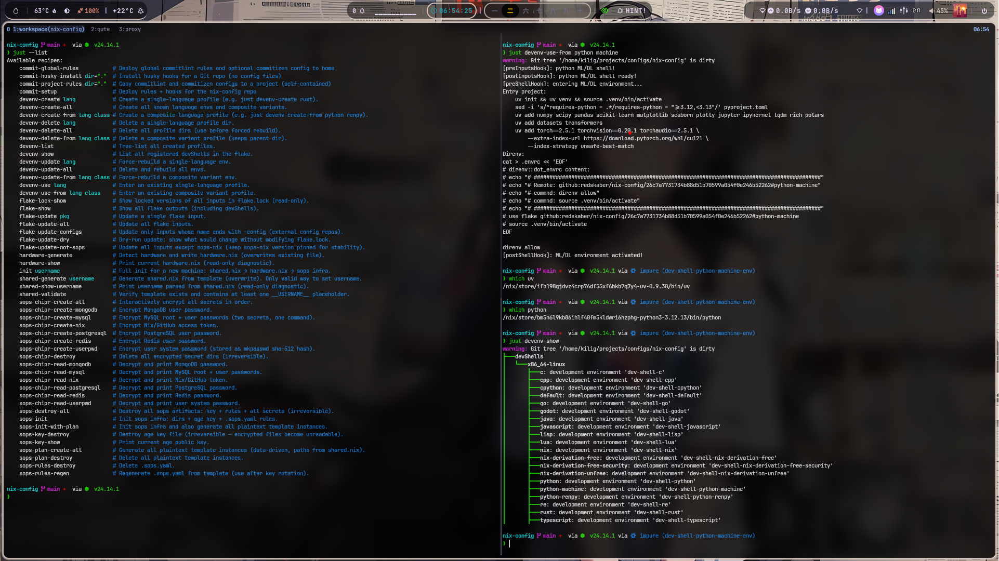
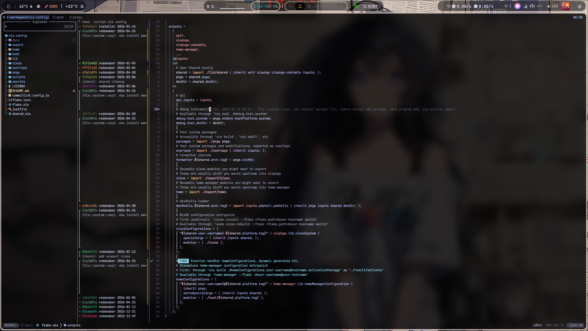
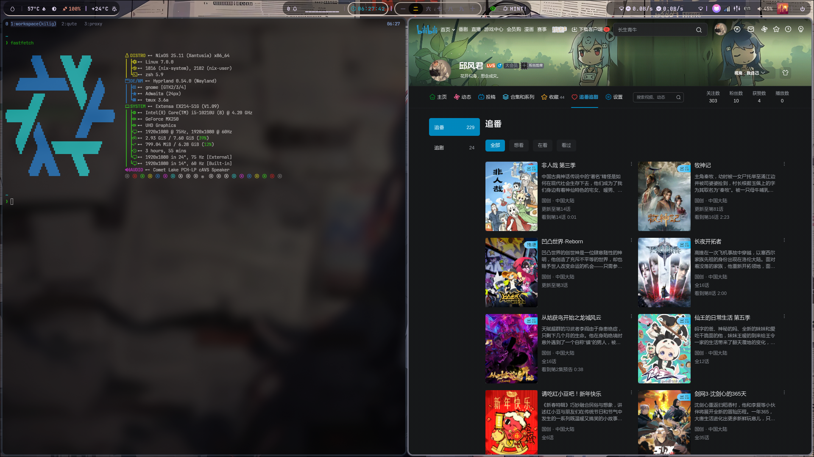
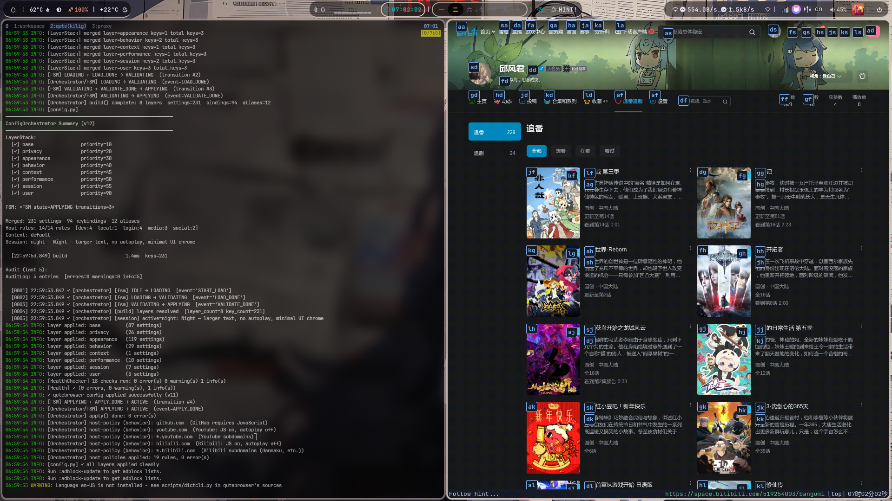
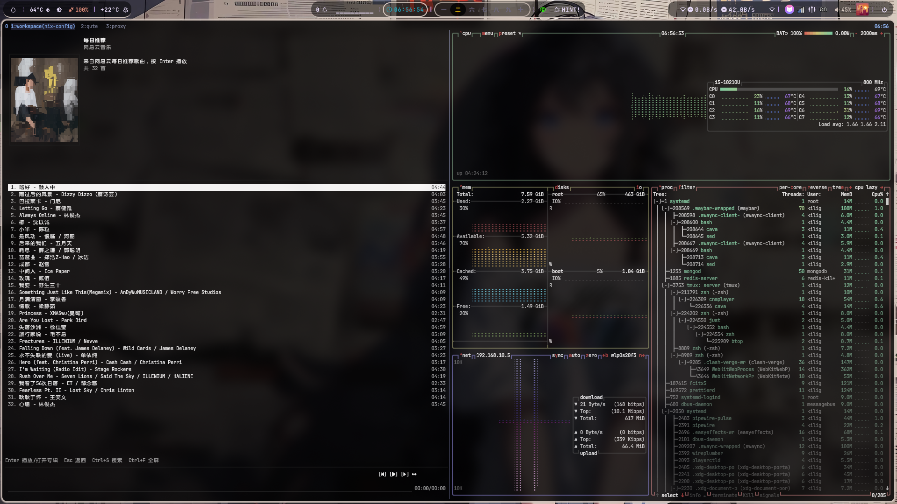

# nix-config

> 声明式、可复现、多平台的系统与开发环境管理
>
> 作者: [@Redskaber](https://github.com/Redskaber) · 构建于 Nix Flakes + Home Manager + SOPS-Nix + nix-darwin + disko

---

## 目录

1. [预览](#预览)
2. [架构总览](#架构总览)
3. [设计原则](#设计原则)
4. [目录语法 — 平台分发层的文法](#目录语法--平台分发层的文法)
5. [目录结构](#目录结构)
6. [核心机制](#核心机制)
7. [快速开始](#快速开始)
8. [跨平台支持](#跨平台支持)
9. [测试体系](#测试体系)
10. [CI/CD 完整执行流](#cicd-完整执行流)
11. [日常操作速查](#日常操作速查)
12. [已知边界与设计债](#已知边界与设计债)
13. [路线图](#路线图)
14. [深入文档](#深入文档)

> 深度内容按受众分层至 `docs/`（[文末索引](#深入文档)）：架构内幕 · 六 Phase 全程 ·
> 九情景 secrets 手册 · 82 recipe 全参考 · CI 深度手册——README 只保留入口层。

---

## 预览

<details>
<summary>part tools summary</summary>












</details>

---

## 架构总览

系统采用严格的层级化管道架构，每层职责单一、边界明确，依赖方向自上而下单向流动。

```
┌────────────────────────────────────────────────────────────┐
│  ENTRY LAYER  ·  flake.nix                                 │
│  统一入口 · 输入声明 · 协议名映射 · api.inputs             │
│  （目标构造已在 SHARED LAYER 生产，此处只消费成品）        │
└──────────┬──────────────────────────────┬──────────────────┘
           │                              │
┌──────────▼──────────┐       ┌───────────▼──────────────────┐
│  SYSTEM LAYER       │       │  USER LAYER                  │
│  platform/<tag>/    │       │  home/ + platform/<tag>/home │
│  default.nix        │       │  home/default.nix → <arch>.nix│
│  硬件·驱动·安全·服务│       │  应用·开发环境·窗口管理器    │
│  core/ · dm/ · wm/  │       │  core/ · env/ · wm/          │
│  （顶层 = 系统域，  │       │  （目录即域，T5.11）         │
│   T5.11）           │       │                              │
└──────────┬──────────┘       └───────────┬──────────────────┘
           │                              │
           │         ┌────────────────────▼──────────────────┐
           │         │  HOST DISPATCH LAYER  ·  platform/    │
           │         │  平台目录 = 目标机描述（target double：│
           │         │  platform 轴选目录，arch 轴选用户域内 │
           │         │  的 payload 行）目录即域（T5.11）：   │
           │         │  顶层 = 系统域（default.nix = 系统海关，│
           │         │  有系统形态的平台才有）；home/ = 用户 │
           │         │  域（唯一保留字；home/default.nix =   │
           │         │  HM 海关，有独立门才有）·  文件存在性 │
           │         │  = 能力声明                           │
           │         └────────────────────┬──────────────────┘
           │                              │
┌──────────▼──────────────────────────────▼──────────────────┐
│  SHARED LAYER  ·  lib/shared/                              │
│  两阶段初始化：lang(前端) → runtime(IR 合成)               │
│  目标工厂 targets.nix：hosts/ 清单 → caps 分类 →           │
│  nixos / darwin / standalone-HM 三类 closure 发射器        │
│  （生产端：flake.nix 只写 inherit (targets) …；            │
│   策略 IR 每主机单实例化，T5.10）                          │
└──────────────────────────────┬─────────────────────────────┘
                               │
┌──────────────────────────────▼─────────────────────────────┐
│  SECRET LAYER  ·  secrets/ + .sops.yaml                    │
│  Age 加密 · SOPS 管理 · 最小权限 · 运行时注入              │
│  TMPL → KEY → RULE → PLAIN → CIPHER → /run/secrets/        │
└──────────────────────────────┬─────────────────────────────┘
                               │
┌──────────────────────────────▼─────────────────────────────┐
│  TEST LAYER  ·  tests/                                     │
│  6 平面 · 93 tests + pre-commit + docs-ssot = 95 checks    │
│         · nmt(零VM) + QEMU · CI 平面整面交接               │
└────────────────────────────────────────────────────────────┘
```

**数据流向（管道）：**

```
shared.nix (策略)
    ↓ just shared-generate
lib/shared (两阶段初始化：lang → runtime)
    ↓ specialArgs / extraSpecialArgs
lib/shared/targets.nix (目标工厂：hosts/ 清单 → caps 分类 → 发射器)
    ↓ 产出成品 closures
flake.nix → inherit (targets) nixosConfigurations / homeConfigurations / darwinConfigurations
    ↓ 三门分发（发射器纯数据驱动目录引用，语法 v3：目录即域）：
    ↓   nixos 系统门 platform/<tag> → default.nix · darwin 单门 platform/<tag> → default.nix（系统路由+arch 分发，HM 内乘） · HM 门 platform/<tag>/home → home/default.nix（arch 路由）
platform/nixos/{default.nix, home/{default,x86_64-linux}.nix} + core/ dm/ wm/ + home/（模块树；app 树按 app-set 重量级路由：full/lean/none）
    ↓ sops-nix (initrd 阶段)
/run/secrets/ (运行时 secret 挂载)
    ↓ systemd services
运行中的系统
```

---

## 设计原则

| 原则         | 体现                                                                                                          |
| ------------ | ------------------------------------------------------------------------------------------------------------- |
| **依赖倒置** | `lib/shared` 定义抽象 schema/enum，上层模块依赖抽象接口而非具体实现；`shared` 作为 specialArgs 注入           |
| **管道流**   | `shared.nix → lib/shared → targets → flake → platform/home → modules` 单向数据流，无反向依赖；三段式镜像编译器管道：lang（frontend）→ runtime（IR 合成）→ targets.nix（codegen） |
| **层级化**   | entry / host-dispatch / system / user / shared / secret / test 七层，职责不交叉，层间通过 `shared` 通信       |
| **增量模式** | 每个子目录均为独立模块，可单独启用/禁用；`imports` 列表即模块注册表                                           |
| **策略管理** | `shared.nix` 集中声明 platform · drive · wm · dm · shell · editor 等所有策略选项，单一真相源                  |
| **分发层收敛** | 平台语义只回答一次：`enum.platform` 行携带 `caps` 能力向量与策略载荷（home-prefix · btop · trace-tools），targets 分类器、发射器与全部叶子读同一张表（`shared.caps.*` / `shared.platform.value.*`）；配置树中零 if-else、零原始 tag 比较（T4.0，借鉴编译器多层管道：后续 pass 查询目标描述，绝不重新词法分析） |
| **状态机**   | `lib/shared/lang/enum.nix` 通过 `nix-types` enum 约束合法状态集合，非法值在求值阶段即报错                    |
| **生命周期** | devShell 四阶段钩子：`preInputsHook → postInputsHook → preShellHook → postShellHook`                          |
| **边界明确** | system layer 不感知用户配置；user layer 不直接操作硬件；host layer 是唯一的平台感知点                         |
| **生成不变** | `shared.nix` 由模板生成（覆盖写入），不可 sed 原地 patch；`.sops.yaml` 同理                                   |
| **数据驱动** | `secrets.just` 零硬编码路径，所有 secret 路径运行时从 `shared.nix` 读取；CI checks 按平面整面交接（`api.checks.planes`，T7.3）    |
| **通信协议** | 层间通过 `shared` attrset 传递（`specialArgs`/`extraSpecialArgs`）；`api.inputs` / `api.shared` / `api.targets` / `api.checks.planes` 暴露 flake 侧信息供脚本与 CI 查询 |
| **数据与解释器分离** | 机器事实归 `hosts/`（facter.json 硬件数据 · disk.nix 磁盘布局 · persist.nix 状态策略），解释能力归平台结构树（nixpkgs facter 模块 · disko 注册 · impermanence + 回滚机制）；主机入口只做一行接线（T5.12/T5.13/T5.14） |

---

## 目录语法 — 平台分发层的文法

平台分发层（`platform/`）遵循**目录即域**文法（v3，T5.11）。读目录即知平台形态，读文件名即知域。

```
platform/<tag>/
├── default.nix        # 系统海关（系统域顶层）—— 有系统形态的平台才有
├── core/ dm/ wm/      # 系统树（nixos 的系统形态子系统，自由生长）
└── home/              # 用户域 —— 唯一保留的顶层名
    ├── default.nix    # HM 海关 —— 平台保有独立 standalone 门才有
    └── <arch>.nix     # HM payload 行（arch 轴的地址）
```

**文法六律：**

1. **顶层 = 系统域，`home/` = 用户域。** 文件存在性 = 能力声明（caps 表在文件系统上的投影）：`linux/`、`wsl/` 顶层没有 `default.nix`，因为它们没有系统形态；`darwin/` 的 `home/` 里没有 `default.nix`，因为它的 HM 不走独立门。
2. **每活门一海关。** `nixos` 双活门 → 两个海关文件（`default.nix` + `home/default.nix`）；`darwin` 单活门 → `default.nix` 一个文件（T5.8 单门折叠：系统路由 + arch 分发 + HM module mode 挂载一体，跨域引用在路径上可见）。
3. **target double。** platform 轴选目录（caps 分类决定哪个发射器到达），arch 轴选用户域内的 payload 行。arch 维仅存在于用户域——系统域的 arch 差异由发射器的 `system` 参数在 nixpkgs 层吸收。
4. **一个路径只有一个含义。** 顶层同名异义债务为零（v2 消灭了 default.nix 双关，v3 把 arch 轴写进目录位置）。
5. **海关只装配/路由，永不装内容。** payload 与系统树互不 import；`hosts/` 是唯一 per-host 差异点。
6. **声明而不存在的路径在 eval 期响亮失败。** 目录路由是字符串插值（`./${shared.arch.tag}.nix`），落到不存在的行即报错——declared-but-absent 从 arch 文件扩展到整个文法。

**五平台形态表：**

| platform | 系统形态 | 独立 HM 门 | 目录形态 |
| -------- | -------- | ---------- | -------- |
| `nixos` | ✅ `default.nix` + `core/ dm/ wm/` | ✅ `home/default.nix` + payload 行 | 双门双海关（策略：standalone HM 秒级切换、独立于系统世代回滚） |
| `darwin` | ✅ `default.nix`（单门折叠，HM 以 module mode 内乘） | ✗（payload 行仍驻 `home/`，由系统关挂载） | 单门单海关 |
| `linux` | ✗ | ✅ `home/default.nix` | 整个平台目录即用户域 |
| `wsl` | ✗（Windows 宿主持有内核侧） | ✅ `home/default.nix` | 整个平台目录即用户域 |
| `nixos-wsl` | ✅ 薄门：`default.nix` = `../nixos` 复用 + NixOS-WSL 解释器（T7.1） | ✅ `home/default.nix`（payload 行回用 nixos 用户域） | 双门；系统海关即整个形态定义：读门即知「nixos customs + WSL 解释器」 |

**子系统路由的两种形态（零 if-else）：**

```nix
# 单选（目录插值）：platform/nixos/dm/default.nix
imports = [ ./${shared.display-manager.tag} ];      # ly → ./ly

# 多选（map 路由）：platform/nixos/core/drive/default.nix
imports = builtins.map (drive: ./${drive}.nix) shared.drive.value;
# shared.drive.value = [ "intel" "nvidia" ] → imports [ ./intel.nix ./nvidia.nix ]
```

---

## 目录结构

顶层七层，各层一个目录、一条职责（**完整注释树**——每个文件干什么——见
[docs/architecture/tree.md](docs/architecture/tree.md)）：

```
nix-config/
├── flake.nix          # entry layer：输入声明 + 协议名映射（成品由 lib/shared/targets.nix 生产）
├── shared.nix        # 策略层（just shared-generate 生成，禁止手动编辑用户名）
├── lib/shared/       # 共享层：lang（前端）→ runtime（IR 合成）→ targets.nix（codegen）
├── platform/          # 分发层：目录即域（nixos · linux · darwin · wsl · nixos-wsl 五形态）
├── home/              # 用户层（HM）：core / wm / env 三域（无根入口，由 payload 行导入）
├── hosts/             # 主机事实：facter.json · disk.nix · persist.nix + shared.nix 覆盖
├── secrets/           # SOPS 密文（chipr/）+ 明文模板（plan/，不入仓）
├── export/            # 可复用模块输出（nixosModules · homeModules）
├── overlays/ · pkgs/  # nixpkgs overlay（additions/patches）· 自定义 derivation（wslview shim）
├── tests/             # 测试层：6 平面（smoke/nixos/home/lib/integration/nmt）
├── scripts/           # just 子模块（13 组动词）+ sh 工具（计数/轮换/导出）
├── docs/              # 深度文档（按受众分层，见文末「深入文档」索引）
└── justfile           # 任务自动化入口（裸 just 打印 start-here 地图）
```

**规模事实**（计数由 `tests/docs-ssot.nix` 机器锚定，T8.1）：`hosts/` 目录实现多主机分发，
每台机器独立硬件事实 + 可选 `shared.nix` 覆盖，当前承载 **5 台主机**（nixos · vm · darwin · wsl · nixos-wsl）；
flake.nix（46 inputs）——nixpkgs 双通道（stable + unstable 第二实例）、5 个自建工具
flake（nix-types · pdshell · configuration-orchestrator · commit-config 及应用 flake）、
22 个外部配置仓（nvim · emacs · wezterm · hypr · waybar …，flake=false inputs）——
完整依赖图见 [docs/architecture/dependency-graph.md](docs/architecture/dependency-graph.md)。

---

## 核心机制

十一层机制，一层一段深度内幕（[docs/architecture/mechanisms.md](docs/architecture/mechanisms.md)）：

| #   | 机制 | 一句话本质 |
| --- | --- | --- |
| 1 | 共享层 · 两阶段初始化 | `lang`（前端：类型/枚举/schema，无 pkgs）→ `runtime`（IR 合成：caps/pkgs/i18nScope）；scfpath 可覆盖，多机器各自策略 |
| 2 | 策略层 · shared.nix 生成 | 模板 + 覆盖写入（不可 sed 原地 patch）；单一策略真相源 |
| 3 | 分发层 · targets.nix | hosts/ 清单 → caps 分类 → nixos/darwin/standalone-HM 三类 closure 发射器；flake.nix 只 `inherit` 成品 |
| 4 | 开发环境管道 · pdshell | 每语言一目录的 devShell 工厂；四阶段钩子；combinFrom 组合 |
| 5 | 安全层 · SOPS + Age | TMPL → KEY → RULE → PLAIN → CIPHER → /run/secrets 六相分层 |
| 6 | 配置编排器 · orc | wallust 主题色跨应用注入（activation hook，含 waybar 主题重载） |
| 7 | 用户环境层 · home/env | 目录即环境域；每文件一个 attrset（key = shell 名） |
| 8 | 外部配置仓库 | flake=false inputs ×22——dotfiles 外置，flake.lock 锁 rev |
| 9 | 提交规范 | Husky + Commitlint + Commitizen 零 node_modules（commit-config flake） |
| 10 | 多主机支持 · hosts/ | 机器事实（facter/disk/persist）与解释器（平台结构树）分离；主机入口一行接线 |
| 11 | 服务按需启动 | service-profile：`install` 与 `autostart` 分离（dev-on-demand / server-pg-only …） |

---

## 快速开始

> 完整六 Phase（含每步前置条件与注意事项）见
> [docs/guides/quickstart.md](docs/guides/quickstart.md)；secrets 按情景的
> 查阅手册见 [docs/secrets/scenarios.md](docs/secrets/scenarios.md)。

**Phase 0 — Nix + just 就绪**（NixOS 自带，跳过）：

```bash
curl -L https://install.determinate.systems/nix | sh -s -- install   # 非 NixOS
mkdir -p ~/.config/nix
echo "experimental-features = nix-command flakes pipe-operators" >> ~/.config/nix/nix.conf
nix shell nixpkgs#just nixpkgs#git        # just 不全局安装，一次性进入
```

**Phase 1 — 克隆 + 策略与密钥基线**：

```bash
git clone https://github.com/Redskaber/nix-config /etc/nix-config && cd /etc/nix-config
just init <username>                       # = 策略生成 + 硬件探测 + user age 密钥 + .sops.yaml 基线
# 服务器机双 key 直达：just key-new-host <alias> → just init <username> <alias> <age1…>
```

**Phase 2 — secrets 就绪**：

```bash
nix shell nixpkgs#mkpasswd --command just secret-set-all   # 逐项录入（输入即加密，明文不落盘）
just secrets-verify                          # 收件人一致性审计（期望全绿）
```

**Phase 3 — 首次部署**：

```bash
just hosts-list                              # 数据驱动主机清单（hosts/ 目录）
sudo nixos-install --flake /etc/nix-config#<host>    # A. 全新 NixOS（LiveISO 分区挂载后）
just nixos-switch <host>                     # B. 接管已有 NixOS
just home-switch <host>                      # C. 非 NixOS（HM 层）；macOS: darwin-rebuild switch --flake .#<host>
```

**Phase 4/5 — 验证回滚与 day-2**：

```bash
just nixos-test <host>                       # 试验性切换（不写 boot 条目，重启即弃）
just nixos-boot <host>                       # 只设下一代引导不激活（T10.2）
sudo nixos-rebuild rollback                  # 一键回上一代
just flake-update-not-sops && just nixos-switch <host>    # 例行更新（sops-nix 锁版本）
```

---

## 跨平台支持

| 平台         | 系统层 | 用户层 | 开发环境               |
| ------------ | ------ | ------ | ---------------------- |
| NixOS x86_64 | 完整   | 完整   | 全部（25 devShells）  |
| Linux x86_64 | —      | 完整（+ nixGL） | 全部          |
| macOS ARM64  | nix-darwin 闭包（eval 级验收，activation 待真机） | 完整（module mode；lean app-set） | CLI 为主 |
| WSL2         | NixOS-WSL 闭包（eval 级验收，T7.1；activation 待 Windows 宿主） | 完整（+ wslview shim，caps.wsl 门控于共享树） | 全部（需启用 systemd） |

---

## 测试体系

测试套件覆盖 6 个平面，总计 **95 checks = 93 tests + 1 pre-commit-check + 1 docs-ssot-check**（计数由 `tests/docs-ssot.nix` 机器强制——README 与 test-matrix 的计数锚点漂移即 CI 红灯，T8.1；本地速查仍可用 `scripts/sh/test-count.sh`，其输出与 CI summary 对账）：

| 平面        | 前缀           | 数量   | KVM            | 关注点                         | 典型时长 |
| ----------- | -------------- | ------ | -------------- | ------------------------------ | -------- |
| Smoke       | `test_`        | 1      | QEMU           | 基本系统完整性                 | ~1 min   |
| NixOS       | `nixos_`       | 29     | QEMU           | platform/nixos/* 模块 + 系统服务 | 2–10 min |
| HM          | `home_`        | 41     | QEMU           | home/* 包安装 + 运行时行为     | 2–8 min  |
| Lib         | `lib_`         | 5      | QEMU 256MB min | lib/shared 纯 Nix 表达式       | <1 min   |
| Integration | `integration_` | 1      | QEMU full      | NixOS + HM 联合激活            | 5–15 min |
| **nmt**     | `nmt_`         | **15** | **✗ 零 VM**    | HM dotfile 内容断言（纯 eval） | <10 s    |

**nmt-Plane 特点：** 纯 Nix eval，无 QEMU，无 KVM，利用 `scrubDerivations` 将包替换为 `@pkg-name@` 占位符，避免触发真实构建（白名单外的包一律擦洗）。适合 CI 最快反馈路径。

**nmt vs HM-Plane 互补：**

```
home/core/exp/sys/base/fd.nix
  ├─ nmt_home_core_exp_sys_base_fd     dotfile 内容断言（纯 eval，<10s）
  │    tests/nmt/home/core/exp/sys/base/fd.nix
  │    .config/fd/ignore: .git/ / *.bak 条目
  └─ home_core_exp_sys_base_fd          运行时行为（QEMU VM，~2min）
       tests/home/core/exp/sys/base/fd.nix
       fd --version, fd finds files by pattern
```

**CI 平面整面交接（无需手动维护列表，T7.3）：**

```bash
# 平面成员由 tests/default.nix 的 planes 面声明——新测试按构造落位其平面；
# CI 直接把整面交给 nix-fast-build（从锁定 nixpkgs 解析，零 registry 漂移）：
nix-fast-build --no-nom --skip-cached -j "$(nproc)" \
  --flake ".#api.checks.planes.nixos"

# 平面分组可独立寻址（与 .#checks.<system> 同形态的 derivation 属性集）：
nix eval ".#api.checks.planes.nmt" --apply builtins.attrNames --json
```

**运行命令：**

```bash
# 全量（需要 KVM；深层求值无 KVM 也可跑 --no-build）
nix flake check

# nmt only（最快，无 QEMU）
nix eval .#checks.x86_64-linux --apply \
  'cs: builtins.attrNames (builtins.filterAttrs (n: _: builtins.substring 0 4 n == "nmt_") cs)' \
  --json | python3 -c "import sys,json; [print(c) for c in json.load(sys.stdin)]" \
  | xargs -I{} nix build ".#checks.x86_64-linux.{}" --no-link

# 单个
nix build .#checks.x86_64-linux.nmt_home_core_exp_sys_base_git -L
nix build .#checks.x86_64-linux.nixos_core_srv_db_postgresql -L
nix build .#checks.x86_64-linux.integration_hm_activation -L

# export/ 模块文档再生（docs.nix 侧通道发射器，T5.3）
nix build .#module-docs    # → result/options/{home-,nixos-}<module>.md + index
```

**nmt 获取机制：** sourcehut 对 Nix fetcher UA 返回 HTTP 403，因此使用 `github:Redskaber/nmt`（mirror）+ `flake = false`，通过 store path 直接引用。`buildHomeManagerTest` 包装器在 `tests/nmt/default.nix` 中自行实现（nmt 原生不提供此函数）。

详见 [`docs/tests/test-matrix.md`](docs/tests/test-matrix.md) · [`docs/tests/nixosTest.md`](docs/tests/nixosTest.md) · [`docs/tests/nmt.md`](docs/tests/nmt.md)

---

## CI/CD 完整执行流

### 为什么 Nix 配置需要 CI/CD

每次变更 nix-config 都等价于声明一个新的系统状态。CI 的核心价值：

1. **求值检查** — 捕获 Nix 语法/类型错误（早于 nixos-rebuild 失败）
2. **深层求值** — 面分片强制（T15.1）：api 信封 + 逐主机 toplevel drvPath + 杂项 checks + 完备性对账（全部 95 checks 必须被平面或杂项清单拥有；单进程 `nix flake check` 因内存累积地板已退役）
3. **Secret 完整性** — 验证加密文件结构正确，`secrets/plan/` 未被提交
4. **测试覆盖** — 93 tests 覆盖 nixos/home/lib/integration/nmt 平面
5. **自动更新** — 每周日自动更新 flake inputs 并开 PR

### 实际 Pipeline（9 阶段，最大并行）

```
push / PR
    │
    ├─► [STAGE 1: Lint & Evaluate]     静态分析 + 浅层 eval（< 2 min）
    │       ├── nix eval .#formatter.*.name          (formatter 可求值)
    │       ├── nix eval .#devShells.* attrNames     (devShells 非空)
    │       ├── nix eval .#nixosConfigurations attrNames  (结构验证)
    │       ├── nix eval .#homeConfigurations attrNames
    │       ├── nix eval .#checks.* attrNames + 平面计数
    │       ├── statix check .                       (Nix 反模式检查)
    │       ├── nixfmt check / deadnix check
    │       ├── Build pre-commit-check derivation
    │       └── Build docs-ssot-check derivation     (T8.1：文档计数锚点)
    │
    ├─► [STAGE 2: Deep Evaluation]     深层求值（硬门禁，T15.1 面分片形态）
    │       └── 面分片强制：api 信封 + 逐主机 toplevel drvPath
    │           + 杂项 checks（docs-ssot/pre-commit）+ 完备性对账
    │           （95 checks 必须被平面或杂项清单拥有——新测试
    │           文件未注册平面即红；短命进程替换单进程 flake
    │           check：内存安全 + 墙钟 120m→预计 15-25m；
    │           纯求值腿：无 magic-nix-cache + infra 签名单次重试，T12.1）
    │
    ├─► [STAGE 3: nmt-Plane]           HM dotfile 断言，纯 eval，无 KVM（< 1 min）
    │       └── nix-fast-build --flake .#api.checks.planes.nmt（并行求值+构建，T7.3）
    │
    ├─► [STAGE 4: devShells dry-run]   devShell 矩阵（并行）
    │       └── rust · python · python-machine · nix · go · cpp · c · typescript · re …
    │
    ├─► [STAGE 4.5: Output Faces]     无独立腿的输出面 drvPath 强制（T11.1，并行）
    │       ├── packages.* 逐成员 drvPath（wslview 教训——deep-eval 的
    │       │   面覆盖是路径依赖的：前面红，后面坏不见；失败成员点名）
    │       ├── homeConfigurations.* activationPackage.drvPath
    │       │   （home 平面测试是 nixosTest VM，从不触此面）
    │       └── darwinConfigurations.* system.drvPath（host-toplevels 的
    │           darwin 求值步在 deep-eval 绿后才跑，本腿不受此门）
    │
    ├─► [STAGE 5: Security Audit]      SOPS 完整性审计（并行）
    │       ├── 供应链钉版契约：全部 action 引用必须 40-hex SHA（T16.1，fail-fast）
    │       ├── secrets/chipr/*.yaml 必须含 sops: 元数据
    │       ├── secrets/plan/ 不得被 git 追踪
    │       ├── .sops.yaml 含 age: + creation_rules:
    │       └── .nix 文件扫描硬编码 token/password
    │
    ├─► [STAGE 6: VM Tests]            QEMU 测试，按平面并行子矩阵（需 KVM）
    │       ├── 每腿一平面，整面交 nix-fast-build（nix-eval-jobs 并行求值
    │       │   + 流水线构建，--skip-cached 对接 magic-nix-cache，T7.3）：
    │       ├── smoke        — 基线（1）
    │       ├── nixos        — 系统模块（29）
    │       ├── home         — HM 模块（41）
    │       ├── lib          — lib 纯表达式（5）
    │       └── integration  — NixOS + HM 联合激活（1）
    │
    ├─► [STAGE 6.5: Host Toplevels]   系统闭包构建（T8.2，无 KVM）
    │       ├── .#api.host-toplevels 整面交 nix-fast-build（inventory 驱动：
    │       │   nixos · vm · nixos-wsl——新 NixOS 主机按构造入列；
    │       │   cache.nixos.org 替代 + magic-nix-cache 跨次缓存）
    │       └── darwin 闭包跨系统仅求值（aarch64-darwin——构建需
    │           darwin runner/交叉工具链，环境门控）
    │
    └─► [STAGE 7: Summary]             汇总报告（always，即使前序失败）
```

> **deep-eval 硬门禁**：早期 CI 不跑 `nix flake check`（sopsFile store 路径在
> `--no-build` 下不物化）。该阻塞已被 `lib/shared/lang/validate.nix` 的
> Result 铁路消除——eval 期对 secret 的检查改为「声明而缺失才报错」，与 store
> 物化无关。深层求值现在是硬门禁（T5.13 曾靠它捕获过 T5.2 改名残留导致的
> 四处坏测试引用）。
>
> **深层求值的面分片形态**（T15.1，run #338 + 首个 120m 窗 run 证据链）：单进程
> `nix flake check` 在单进程内累积全部 95 checks 的活跃求值态——本地 4GB 沙箱
> 在第 9 个 derivation 处 OOM（实测 anon-rss ~2GB 且持续增长），7GB runner 处于
> 临界边缘慢爬（run #338 90 分钟超时；首个 120m 窗 run 在 49min+ 仍在求值）；
> 同树同日的 output-faces 腿（同冷 store、同 inputs）1m52s 完成——因为每个
> 成员都是短命进程。面分片保留深层求值契约（每个输出面的求值级证明）但
> 分发到短命进程：api 信封 + 逐主机 toplevel（实测单 attr 峰值 RSS ~1GB，
> 进程退出即释放）+ 杂项 checks + 完备性对账（flake check 隐式「遍历一切」
> 兑底的显式化：新测试文件逃逸平面注册即红）。
>
> **缓存策略按腿类分发**（T12.1，2026-10 run #336 事故裁决）：构建腿
> （lint / nmt-plane / vm-tests / host-toplevels）保留 magic-nix-cache——
> 跨次缓存真闭包，被限流时回退 cache.nixos.org；纯求值腿（deep-eval /
> output-faces / evaluate-devshells）不装——`--no-build`、drvPath 强制、
> dry-run 都不替代任何闭包，构建缓存在此没有可提供的，只剩失败面
> （GHAC ResourceExhausted → 418 narinfo → 源路径 mid-copy 死为
> `path … is not valid` → 拖入 90 分钟超时）。deep-eval 另带 infra 签名
> 单次重试：树侧错误立即红，基础设施类才退避重试。

**本地预检清单（push 前）· 部署工作流 · 世代管理细节 · 自动化更新策略**
→ [docs/ci/pipeline.md](docs/ci/pipeline.md)。

---

## 日常操作速查

> 全量动词面共 82 个 recipe，`[group]` 注解分 13 组——终端 `just --list` 或
> [docs/just/reference.md](docs/just/reference.md)；裸 `just` 打印 start-here 地图。

### deploy — 部署动词（nixos-rebuild 三语义 + HM）

```bash
just nixos-switch <host>      # = sudo nixos-rebuild switch --flake .#<host>（激活）
just nixos-test <host>         # test：试验性切换，重启即弃
just nixos-boot <host>         # boot：只设下一代引导不激活（T10.2）
just home-switch <host>        # standalone HM（→ <username>@<host>）
just hosts-list                # 主机清单（hosts/ 目录数据驱动）
```

### 开发环境 — devShells 与 profile

**可用 devShells 速查（25 个，`nix eval .#devShells.x86_64-linux --apply builtins.attrNames`）：**

| Shell 名称                     | 组合内容                              | 特性                          |
| ------------------------------ | ------------------------------------- | ----------------------------- |
| `rust`                         | rustc + cargo + rust-analyzer         | clippy · rustfmt              |
| `go`                           | go + gopls + delve                    | 中国镜像 · 项目级缓存         |
| `python`                       | python314 + uv + pyright              | ruff · bytecode 缓存隔离      |
| `python-machine`               | C + Python + gcc.cc.lib               | ML/DL 工具链 · GPU 指引       |
| `python-renpy`                 | python314 + renpy + unrpyc            | Visual Novel 开发             |
| `cpp`                          | pure LLVM (libc++ + clangd)           | lld · lldb · bear · ccache    |
| `c`                            | clang + clangd + lld                  | bear · ccache · cmake · ninja |
| `asm`                          | nasm + binutils                      | 汇编                          |
| `java`                         | temurin-21 + maven + jdt-ls           | gradle                        |
| `typescript`                   | node26 + tsc + tsx                    | typescript-language-server    |
| `javascript`                   | node26 + biome                        | pnpm · yarn                   |
| `nix`                          | nix + nil + statix + nixfmt           | deadnix · nvd                 |
| `nix-derivation-free`          | + nix-output-monitor + nixpkgs-review | PR 审查工作流                 |
| `nix-derivation-unfree`        | + patchelf + sbomnix + gpg            | 闭源软件构建 · 合规           |
| `nix-derivation-free-security` | + vulnix                              | 安全扫描                      |
| `nix-nonfmt`                   | 无 formatter 干扰的裸 nix shell        | 脚本编写                      |
| `re`                           | LLVM + 完整逆向工具链                 | pwntools · frida · ghidra     |
| `lua`                          | lua54 + luajit + lua-language-server  | stylua · luarocks             |
| `lisp`                         | sbcl + rlwrap                         | pkg-config · gcc              |
| `zig`                          | zig + zls                             |                               |
| `default`                      | 全语言 combinFrom 合并                | 综合开发环境                  |
| `cpython`                      | C + C++ + Python 组合                 |                               |
| `godot`                        | C + C++ + Python + godot              | 游戏开发                      |
| `makeOs`                       | asm + c + qemu_full + just            | OS 实验环境                   |
| `rs_compiler_dev`              | rust + 编译原理工具链                  | rs 开发                       |

```bash
# 一次性进入（不保存 profile）
nix develop .#rust · .#python · .#python-machine …
# 持久化 profile（离线可用；命名 <username>-<lang>[-<class>]，落 ~/.local/state/nix/profiles/dev/）
just devenv-create rust                        # 单语言
just devenv-create-from python machine         # 复合变体（C + Python ML/DL）
just devenv-use [-from] <lang> [<class>]       # 进入已有
# direnv 自动激活（推荐）
echo "use flake github:Redskaber/nix-config#python-machine" > .envrc && direnv allow
```

### secrets — 速查表（一条命令一个意图）

| 意图 | 命令 |
| --- | --- |
| 我有哪些加密内容 / 缺哪个 | `just secrets-list` |
| 录入 / 改一个秘密 | `just secret-set <alias>` |
| 看一个秘密 | `just secret-get <alias>` |
| 编辑一个秘密 | `just secret-edit <alias>` |
| 全部录入（顺序） | `just secret-set-all` |
| 谁能解密（钥匙/规则总览） | `just secrets-status` |
| 规则 ↔ 密文一致性 | `just secrets-verify` |
| 改了规则后对齐密文 | `just secrets-sync` |
| 生命周期地图 | `just secrets-guide` |

> 层级模型一行：TMPL → KEY → RULE → PLAIN → CIPHER → `/run/secrets/`；
> 入口 `just secrets-guide`（状态机 + 动词矩阵 + 情景流）。
> 九情景手册（day-one / 双 key / 接入服务器 / 第二台机 / 双向轮换 / 失陷应急 /
> 新增 / 销毁）：[docs/secrets/scenarios.md](docs/secrets/scenarios.md)；
> 轮换 runbook：[docs/secrets/rotation.md](docs/secrets/rotation.md)。

### 世代与回滚

```bash
sudo nixos-rebuild rollback                                                   # 回上一代
sudo nix-env --profile /nix/var/nix/profiles/system --switch-generation <N>   # 指定世代
sudo /nix/var/nix/profiles/system/bin/switch-to-configuration switch
```

---

## 已知边界与设计债

诚实清单——以下是当前已知的边界与待偿债务（修复均有明确路径，不阻塞使用）：

1. ~~**`platform/nixos/core/base/wsl.nix` 处于休眠态。**~~ **已解决（T7.1）。**
   第五 platform 行 `nixos-wsl` 落地（caps.wsl = true 的系统形态），caps 门首次被真实
   主机点亮；同时手写的 WSL 面被移除（wsl.conf/binfmt/getty/resolv 由上游 NixOS-WSL
   解释器单一持有，本仓只保留 chrony 时钟漂移防护的真差量），用户空间 interop 提升到
   共享树（home/core/base/wsl.nix，caps.wsl 门控，两个 wsl 主机单地址消费）。
2. **drive 指纹与策略不同步（hosts/nixos）。** 基策略声明 `drive-group.intel`（单），
   而 `hosts/nixos/default.nix` 仍携带完整的 NVIDIA-Prime offload 指纹块
   （`intelBusId`/`nvidiaBusId`）——它们要等一个 `*-nvidia-prime` drive-group 行被
   选中才会生效。指纹是无害的提前声明，但读者应知道它当前是惰性的。
3. ~~**display-manager 枚举无 `none` 行。**~~ **已解决（T7.1）。** 枚举加行 +
   `platform/nixos/dm/none/` Null-Object 模块（与 window-manager none 同构：存在性
   保持路由无条件）；系统侧 wm/none 同步补齐——hosts/nixos-wsl 的控制台形态需要
   「无 DM、无 WM」的完整语法。
4. **darwin `system.stateVersion = 6` 是整数。** nix-darwin 的该选项接受整数
   （与 NixOS 的字符串不同），这是一个已知的类型怪癖，已在 hosts/darwin/default.nix
   注释中说明。
5. ~~**standalone HM 发射器的 pkgs 取自基策略实例。**~~ **已解决（T7.2）。**
   mkHomeSystem 现在读取主机自身策略实例的 pkgs（`pkgs = hshared.pkgs`，targets.nix）——
   运行时层本就按主机 arch 实例化 nixpkgs（`pattrs = { system = arch.tag; } ⊕ nixpkgs
   策略`），发射器如今与之对齐：未来的 aarch64-linux standalone 主机按自己的 arch 求值。
   对现有全部主机字节恒等（三个未动 HM 闭包 drv 哈希逐一验证——本修复是可表达性，
   不是行为变化；hm-vm 的偏移全部归因于同一提交的 wm 翻转）。
6. ~~**vm 继承基策略的 hyprland + ly。**~~ **已解决（T7.2）。**
   hosts/vm/shared.nix 覆写 wm/dm 两行 none：server-pg-only 形态不再携带永不启动的
   桌面闭包。桌面栈整体减除（hyprland / ly / portal 中介 / flatpak / gvfs / tumbler
   全 off），机器故事无损（btrfs ephemeral root、/persistent、postgresql 探针逐一
   保持）；vm 求值 12.4s→9.6s，hm-vm 包集 140→114。
7. **eval 成本记录。** nixos toplevel 求值 ~16.8s（disko extendModules 选项树
   +1.5s 已记录在案）；vm toplevel 求值 ~9.6s（T7.2 控制台化后自 12.4s 降——桌面
   模块树离开了 vm 的选项宇宙）；六闭包顺序求值 ~65s（T5.10 后自 90s 降）。单进程
   全输出 `nix flake check` 在 4GB 内存沙箱会 OOM（六 OS 级模块宇宙的内存地板，
   与策略实例数无关；实测第 9 个 derivation 处 anon-rss ~2GB 且持续增长）——
   CI 以**面分片短命进程**规避（T15.1：单 attr 峰值 ~1GB、进程退出即释放；
   这也是 run #338 90 分钟超时的根因——7GB runner 在临界边缘慢爬）。
8. **boot 级与真机验收待环境。** 第二台机器 boot 级验收（KVM/真机，含 T5.14 ephemeral
   root 的回滚真机验收——求值/构建级已全绿：配方派生/双 initrd 模式/惰性律由
   nixos_core_base_impermanence 锁定，formatMount 真实构建，但「每次启动根被归档重建」
   本身需要一次真实 btrfs 启动）、macOS activation（真 Mac）、hosts/nixos 的 disk.nix
   应用（重装时机）——四者都已有完整路径，等待对应环境。
9. **sound 栈门控：机械半部已落地（T10.1），语义裁决待真机。** sound
   现在是独立策略轴（enum `sound`：`pipewire` 全栈 / `none` Null-Object，
   携带 `sound-server` 位与 `mixers` 工具带），sound.nix 读已解析事实
   门控（T4.0 定律），schema 将其列为必需键——每条策略链必须回答该轴。
   `nixos_core_base_sound_gate` 锁定双律（pipewire 形全栈 / none 形
   整体减除）。全部现有主机保持 pipewire 行：五个 HM/darwin 闭包字节
   一致，三个 NixOS toplevel 值面探针全同（drv 哈希的移动通道见 #10）。
   剩余语义半部仍是环境门控：vm（QEMU 音频设备）与 nixos-wsl（WSLg
   经 pulse 的 Windows 桥）是否翻none 行，待首次真机验收裁决——
   届时翻转 = 每主机一行数据，非文件编辑。
10. **NixOS toplevel 的 drv 哈希追踪源树内容。** `nix.registry` 的 self
   条目（nix.nix 的 `registry = mapAttrs (_: flake: { inherit flake; })
   flakeInputs`，含 self）把 flake 源树的 narHash/lastModified 写进
   /etc/nix/registry.json——任何提交（包括纯注释）都会移动三个 NixOS
   toplevel 的 drv 哈希。这不是缺陷（registry 指向当前树是正确语义），
   但字节一致性验证对 toplevel 不适用：等价性须走 config 值探针。
   T10.1 首次完成该通道归因：etc → activate → dry-activate 三输入的漂移
   全谱 = registry 23 条目中恰 1 条（self）的 narHash 差异。HM ×4 +
   darwin ×1 五闭包不导入 nix.nix，不受影响，字节一致性照常成立。

---

## 路线图

- [x] CI 全量 build 验证（nmt-Plane + QEMU VM tests，7 阶段流水线）
- [x] NixOS 测试套件（91 checks = 90 tests + 1 pre-commit-check〔内含 nixfmt/statix/deadnix 三钩子〕，6 个测试平面）
- [x] flake inputs 自动更新策略（定时 PR，每周日）
- [x] platform/ 平台分发层（nixos · linux · darwin · wsl，arch 路由）
- [x] api.inputs 暴露（just 脚本动态枚举 inputs，零硬编码）
- [x] AI CLI 工具集成（claude-code · opencode · gemini-cli · kiro-cli · cursor-cli · pi-coding-agent）
- [x] kiro 编辑器集成（home/core/exp/app/editor/kiro.nix）
- [x] nmt mirror 解决方案（sourcehut 403 规避，buildHomeManagerTest 自实现）
- [x] sops 数据驱动架构（零硬编码路径，phase-aware 信息源分离）
- [x] secrets just 生命周期重设计（T5.0：仓库出厂态 = EMPTY——`.sops.yaml` 与密文 blob 全部由 just 流程生成（`secrets-init`/`secret-set`）后入库，不携带预置密钥材料；动词面按三对象重组 secret-*/key-*/rules-* + 注册表驱动（12 个 per-secret recipe → 1 张别名表）；`just`（裸）= start-here 地图 + `[group]` 分组的 `just --list`；eval 期 resolution pass 对 EMPTY 态宽容（零 blob → trace 引导，≥1 blob → 严格 declared-but-not-provided）+ fixture 化契约测试；CI security 全步骤 EMPTY 容忍；README 多情景手册（9 情景 × 速查表）+ 全流程文档同步）
- [x] tools.nix 工具库统一管理（nix-types / orc / pdshell 短路径访问）
- [x] hosts/ 多主机支持（per-machine facts + overrides；facter/disko 声明式形态，T5.12/T5.13）
- [x] service-profile 按需启动（install vs autostart 分离，dev-on-demand / full-autostart / server-pg-only / minimal）
- [x] editor-set / terminal-set / browser-set 集合路由（多选路由模式）
- [x] version 策略携带（variant 携带 {stateVersion, wine, swww} 策略）
- [x] shellIntegrations 统一（runtime 计算，8 个 base 模块复用）
- [x] match 穷尽性（nix-types lib.match 替代手写 if）
- [x] 分发层收敛（T4.0：enum.platform 能力表 caps + 策略载荷；全树消灭叶子级 if-else/谓词重复推导/tag 比较；schema 嵌套默认值物化修复；变异验证 ×2 + 六配置求值级行为保持——home×3/darwin drv 字节一致）
- [x] 入口清爽化（T5.1：flake.nix 只保留输入声明 + 协议名映射；主机清单→caps 分类→closure 发射器全部移入 lib/shared/targets.nix 生产端——编译器后端 pass；根目录 darwin/ 并入平台树，host-dispatch 层一个平台一个目录；pre-commit 配置移入 tests/pre-commit.nix）
- [x] 中间层命名收敛（T5.2：lib/shared/shared → lib/shared/lang——语言前端层（类型/枚举/schema/验证，无 pkgs），消除路径重复命名；三段式镜像编译器管道：lang（frontend）→ runtime（IR 合成）→ targets.nix（codegen）；`shared` 逻辑名保持为全树稳定线协议，测试镜像与 check 名同步 lib_shared_lang_*）
- [x] pre-commit-hooks（nixfmt + statix + deadnix 自动检查）
- [x] services.just 按需启动命令（service-start/stop/status + db-start/stop/list）
- [ ] 第二台机器测试（验证跨机器可移植性，scfpath 多机器场景）（T2.3-T2.5：hosts/vm 策略链已通，双机求值级验收完成；boot 级验收待 KVM/真实环境）
- [x] 惰性模块加载（T5.10：两 pass 一 commit——**Pass A 策略 IR 单实例化**（分发层 CSE：mkShared 每 flake 求值 ~23 次 → targets.nix 建 `sharedByHost = genAttrs hostNames mkShared` 单表，分类器/发射器/命名/别名全部读表；默认主机表项 = 基实例〔句柄共享即不为默认主机付两次费〕；flake.nix 基 shared 改 consume `targets.base`；遗留别名从重发射改为 attr 级 thunk 别名〕。**Pass B app-set 需求驱动模块装载**（app 树重量级轴：editor/browser/terminal 三选集回答"已路由目录内选哪些叶"，app-set 回答"app 树里哪些目录为该主机存在"——full〔16 目录，顺序即旧静态 import 表，enum 测试锁定防序漂移〕/ lean / none；runtime 发布 `appCategories` 展平句柄；wps-office-cn 补 linux-family caps 门〕。**验证**：hm-nixos nqvaivz 字节一致；hm-vm/hm-wsl 各 −55 包、darwin −12 包〔包集 diff 穷尽归因于被剪目录贡献〕；六闭包顺序求值 90s→65s）
- [x] 模块文档自动生成（从 Nix 模块 options 生成）（T5.3：lib/shared/docs.nix 侧通道发射器——HM 域共享基础 option 集 + NixOS 域全量 eval-config 单次求值，namespace 过滤只保留 redskaber.*，域前缀六份 CommonMark + index；`nix build .#module-docs` 一键再生）
- [x] darwin 平台调用机制统一（T5.4：分发层发射器全部目录导入；platform/darwin/default.nix 补齐 arch 路由器，HM payload 迁至 aarch64-darwin.nix；三 closure + 双 HM drv 哈希字节级一致验证）
- [x] darwin 发射器装配内聚（T5.5：home-manager.darwinModules.home-manager 从 mkDarwinSystem 的 modules 列表移入平台树内 imports——darwin 系统形态拥有自己的 HM 集成；三类发射器收敛为完全同构的单行目录引用）
- [x] 平台架构完成：nixos 系统树归位（T5.7：根级 nixos/ 树 → 平台目录内——「一平台一目录」补全；系统海关与 HM 海关按域分立；hosts 路由与 tests 镜像同步；72 文件 @path/@description 头部同步）
- [x] darwin 单门折叠：default.nix 即边界海关（T5.8：platform/darwin 的系统装配折叠进 default.nix，arch 分发同文件内联；折叠可行性判据 = 活门计数——darwin 单活门 → 单文件海关；nixos 双活门 → 不可折叠〔单文件双域需 options 存在性嗅探 = 配置层 if-else，被禁〕；「每活门一海关」成为平台目录布局的第一性判据）
- [x] 平台目录语法 v2：文件名即域（T5.9：消灭 default.nix 同名异义——看文件名即知域；目录语法四轴归一——系统层|用户层 · 平台-架构 · 分发层级 · 职责边界；文件存在性 = 能力声明〔caps 表在文件系统的投影〕；结构零行为变更：76 文件 rename/路径同步，四闭包 drv 哈希与基线字节一致）
- [x] 平台目录语法 v3：目录即域（T5.11：用户域获得自己的层级——platform/&lt;tag&gt;/home/ 子树〔唯一保留的顶层名〕，HM 海关 home/default.nix、payload home/&lt;arch&gt;.nix〔arch 轴在用户域内获得地址〕；darwin payload 归位用户域子树，系统关挂载行 `users.&lt;u&gt; = import ./home/${arch.tag}.nix` 使跨域引用在路径上可见；三发射器统一目录引用；hosts/ 驻留根的裁决固化〔前端源树 vs 后端能力树，层不倒置〕；求值级等价验证：四闭包 drv 哈希与基线字节一致，nixos/vm 差异漏斗溯源闭合于 flake self 快照〔树哈希因 rename 变化，语义零变化〕）
- [x] export/ 模块完善（T2.1 首批五组：portal / fcitx5(nixos+home) / shell / waybar / yazi，options-first + 外部导入验收测试；接口规范见 docs/modules/interface-standards.md）
- [ ] macOS 完整支持（darwin-specific modules，nix-darwin 集成）（T3.2：darwinConfigurations.darwin 全闭包求值级验收完成——nix-darwin 26.05 + hm module mode；activation 待真实 Mac）
- [x] 策略表补全（T7.2：**vm 瘦身**〔债 #6〕——hosts/vm/shared.nix 覆写 wm/dm 两行 none：server-pg-only 形态不再携带永不启动的桌面闭包，桌面栈整体减除〔hyprland·ly·portal 中介·flatpak·gvfs·tumbler〕、机器故事无损〔btrfs ephemeral root / /persistent / pg 探针逐一保持〕、vm 求值 12.4s→9.6s〔−23%，桌面模块树离开选项宇宙〕、hm-vm 包集 140→114〔−26〕；**standalone 发射器按主机 arch 解析 pkgs**〔债 #5〕——mkHomeSystem 改读主机自身策略实例的 hshared.pkgs〔运行时层本就按 arch 实例化 nixpkgs〕，aarch64-linux standalone 从此可表达；三个未动 HM 闭包 drv 字节一致〔nqvaivz·8b0srg82·sd3d2kx9〕——可表达性修复零行为变化；**策略行巡检三发现**——① portal.nix 无 desktop-session 门〔控制台形态携带 xdg-desktop-portal+wlr portal，与 home 侧 none 策略的设计矛盾〕→ 门控于 window-manager 枚举的 desktop-session 能力位〔T4.0 定律：读已解析事实，非原始 tag 比较〕；② srv/desktop/ 组〔flatpak+file-manage〕同为桌面会话服务，且 flatpak 的 nixpkgs 断言硬依赖 xdg.portal.enable〔门控 portal 后断言立刻爆出——求值级验证电池抓到的真缺陷，两模块共读同一能力位修复〕；③ sound 栈无门控但刻意缓议〔WSLg/QEMU 音频语义需真机裁决，新债 #9〕；**新测试 nixos_core_base_portal**〔export-modules 模式：desktop 形态门开 + 真实 vm 机经 mkShared 同构构造——门控双律 + 债 #6 减除全谱 + 机器故事存活；断言强制经变异验证〕；93 checks〔92 tests + 1 pre-commit〕；裸金属 nixos 探针字节一致〔门控对桌面形态=恒等——mkIf true 语义〕；T7.1 的两处枚举成员表残留顺手修复〔platform 行补 nixos-wsl、display-manager 行 none 注记〕）
- [x] CI 构建深度（T7.3：**测试矩阵双面化 + nix-fast-build 整面交接**——tests/default.nix 返回值从单一平铺 attrset 升级为 `{ checks, planes }` 双面〔同一组成员 thunk、两种寻址零额外求值——T5.10 单实例化纪律〕：平铺面仍由 `checks.${system}` 消费〔`nix flake check` 要求每属性恰一个 derivation——中断会话留下的嵌套结构会让 checks 输出含非 derivation 成员，硬门禁必炸〕，平面面经 `api.checks.planes` 暴露〔六平面分组 = 分类法自身的分组〕；**CI 两阶段转换**——STAGE 3 nmt-plane 与 STAGE 6 vm-tests 的前缀发现 + 顺序循环全删〔python 前缀过滤 + 逐个 nix build 共约 90 行〕，改为 `nix-fast-build --flake .#api.checks.planes.<plane>`〔nix-eval-jobs 并行求值 + 流水线构建；`--skip-cached` 对接 magic-nix-cache；`-j $(nproc)` 显式并行——1.4.0 默认继承 Nix max-jobs=1，不传即退化串行〕；**确定性供应链**——nix-fast-build 从锁定 nixpkgs 解析〔`nix eval --raw .#api.inputs.nixpkgs.outPath` → store path 作 flake ref〕，与 flake 同一 revision，零 registry 漂移、零新输入〔T6.3 裁决的采纳落地；1.4.0 + 捆绑 nix-eval-jobs 2.34.3，`-f` 任意 attrpath / `--force-recurse` 递归 / 无 system 后缀逻辑——语义经知识搜索对上游 1.4.0 tag 源码核实〕；**矩阵 4→5 腿**——home-lib 合并腿拆开〔每腿恰一平面，平面面成为 CI 分区 SSOT——新测试按构造落位其平面，CI 侧零维护〕；lint 阶段平面计数同改读 planes 面〔不再前缀重推导〕；**顺手修复**——vm-tests 的 `::add-mask::$AGE_SECRET_KEY` 引用错误〔env 实为 SOPS_AGE_KEY——旧代码掩码的一直是空串〕；**验证**——等价断言〔平铺−pre-commit ≡ 六平面之并且逐平面 ≡ 旧前缀过滤结果，无交叠分区：1+29+41+5+1+15=92〕、六平面可独立寻址、93 checks 深层求值全绿、YAML 解析通过、锁定 nix-fast-build `--help` 实测旗标齐备〔--no-nom/--skip-cached/-j/-f〕；对标 Mic92 CI 的构建深度达成——闭包级构建（真 toplevel 构建深度）仍属环境门控〔CI 无 KVM 全档或自托管 runner 时再议〕）
- [x] docs-SSOT 计数契约（T8.1：**计数从「人工同步」升级为「机器强制」**——tests/docs-ssot.nix 入列 checks 第 94 员〔pre-commit-check 的同位仓库卫生门〕：活值从求值取〔tests 92 / 平面 1+29+41+5+1+15 / inputs 46〔`@inputs` 捕获含 self 注入故扣除〕/ devShells 25 / hosts 5——attrNames 与 mapAttrs，永不解析散文〕，19 个规范锚点在 README 与 test-matrix 构建期断言〔散文锚 grep -F、表格行 grep -E 填充容错〕；模式来源 wimpy `checks.assistant-catalogue` 的逆向适配——断言内嵌而非生成对拍〔本仓 README 是手写散文非生成物，只锚规范声明、刻意不锚每处散文提及——锚全部句子会让 README 不可编辑〕；**设计期即抓四处真实漂移**〔devShells 速查表缺 makeOs 行而活值 25、test-matrix 3.1 节头滞留 24、3.3 节头滞留 3、3.2 节合计 36 缺 export 行〕——全部修复；**构建期强制**〔deep-eval 只求值〔runCommand 恒构造〕，锚点断言在 build 时触发——CI STAGE 1 在 pre-commit-check 旁显式构建，计数漂移即红灯〕；flake.nix 接线〔checks = tests // pre-commit // docs-ssot 三段合并 + pdsh hoist 单次构造双消费 + inventory/devShellNames 传参——键级求值零额外成本，T5.10 纪律〕；**验证电池抓真缺陷**：首版裸返回派生体 → `//` 把 drv 属性泼进 checks 面〔outPath/__structuredAttrs/userHook 混入且成员丢失——pre-commit.nix 头警示过的同类〕→ 面求值 138 员立刻暴露 → 包裹 `{ docs-ssot-check = …; }` 修复后恰 94 员零泼洒；变异验证〔box 94→93 → 构建 FAIL 带可操作信息；复原 → 绿〕；五闭包字节一致〔nqvaivz·s61py9qg·8b0srg82·sd3d2kx9·dqhyw65——检查对主机/HM 闭包零扰动〕；test-count.sh 权威让位〔本地速查保留，公式 +1→+2〕；钉版 pre-commit-check 构建绿）
- [x] CI 主机闭包构建腿（T8.2：**构建深度从「测试平面」升级到「真系统闭包」**——api.host-toplevels 第五 api 面〔inventory 数据驱动：nixosHosts 枚举——nixos · vm · nixos-wsl，新 NixOS 主机按构造入列，零 CI 侧维护；成员 = `nixosConfigurations.<h>.config.system.build.toplevel`——与深求值同一 thunk，T5.10 单实例化〕；CI STAGE 6.5 新腿〔needs lint+deep-eval；与平面腿同工具同纪律——锁定 nixpkgs 解析 nix-fast-build、整面交接、`--skip-cached -j $(nproc)`；可行性依据：cache.nixos.org 同 revision 替代 + magic-nix-cache 跨次缓存〔Mic92/wimpy 同型先例〕；darwin 跨系统闭包显式求值步〔aarch64-darwin 构建需 darwin runner/交叉工具链——环境门控，路径已备〕〕；**T7.3 裁决升级**〔当时「闭包级构建属环境门控」的缓议，经 8-a 评分刷新认定 stock runner + 替代缓存即够——缓议条件不成立故升级，非推翻〕；summary 表 + 分支保护清单同步；流水线 7→8 阶段（ci.yml 头注释 + README 三处）；api.* 接口文档补第五面；验证：api.host-toplevels 三成员求值绿 + 与深求值同源、五闭包字节不变、YAML 解析 + bash -n、nixfmt + 钉版 pre-commit 绿〕
- [x] nixos-facter 替代 nixos-generate-config（声明式硬件发现）（T5.12：硬件事实从「生成的 NixOS 模块」升级为「数据 + 解释器」——hosts/&lt;h&gt;/facter.json 是标准 facter 报告〔schema version 1，与锁定 nixpkgs 的 nixos-facter 0.4.4 一致〕，由 nixpkgs 默认模块表内的 `hardware.facter` 模块解释，主机入口一行接线——零 import、零 flake input；**模块上游化裁决**：nixos-facter-modules 仓库已弃用并入 nixpkgs，本项目不加输入直接消费；hosts/vm 全量迁移〔VM 硬件本是被定义的：QEMU x86_64 PCI guest——kvm 虚拟化、virtio-blk 盘 + 存储控制器、virtio-net 网卡、无 vmx/svm 的 vCPU；报告由声明而非探测产生，字段与真实报告逐一对齐〕；解释器职责边界固化：fileSystems 非报告职责〔上游留待 disko〕、network_interface 刻意不列〔NetworkManager 策略拥有 DHCP——CONTROLLER 在报告中，驱动照样进 initrd〕；真实机器〔hosts/nixos〕迁移路径落地：`just hardware-facter`〔root 扫描生成报告〕+ README 迁移指南；求值级等价验证：vm 配置 diff 穷尽闭合于三处 facter 解释，其余四闭包 drv 哈希字节一致）
- [x] disko 声明式磁盘分区（替代 hardware.nix 里的 fileSystems 硬编码）（T5.13：磁盘事实从「手写 option 赋值」升级为「数据 + 解释器」——hosts/&lt;h&gt;/disk.nix 是 disko 布局声明〔GPT + EF02 BIOS boot 1MiB + root ext4 100%，上游 gpt-bios-compat 形态〕，由 disko 模块解释为 fileSystems + swapDevices + boot.loader.grub.devices；**注册裁决**：disko 不在 nixpkgs〔已对锁定 26.05 树核实〕，新增 flake input〔tarball-pinned 至 v1.13.0；follows 本仓 nixpkgs 单通道〕，模块 import 落 platform/nixos/core/base/disk.nix——能力归平台结构树、数据归 hosts/，分发层与发射器零改动；hosts/vm 全量迁移 + 引导策略对齐〔grub on / systemd-boot off〕；求值级验证：vm 配置 diff 穷尽闭合于六处，hosts/nixos 配置零变化〔模块惰性〕；四闭包字节一致；构建级探针：formatMount 脚本真实构建成功；顺带修复存量缺陷：T5.2 改名残留的四处测试引用 + 两处文档引用〔nix flake check 自 T5.2 起即坏〕，89/89 checks 现全绿；just 新增 disk 组动词〔disk-show/disk-format〕）
- [x] Option/Result 类型化错误处理（T4.1：secret 路径校验用 result.andThen —— nix-types Result 铁路〔shared/validate.nix〕：形状检查前置 pass 折叠 + 文件系统存在性 resolution pass + unwrapOrElse 单一边界 throw；声明而缺失的 secret 在 eval 期报「declared but not provided」；变异验证 ×2 + home×3/darwin drv 字节一致）
- [x] 可观测性（prometheus exporters + loki 日志 + grafana dashboard）（T3.4：service-profile 携带 monitor 策略，三档 profile 求值级验收 + nixos_core_srv_monitor_policy 测试）
- [x] 健康检查（数据库服务加 systemd HealthCheck）（T3.4：双层——Restart 自愈兜底 + 30s liveness timer 探活，60s 可观测窗口，变异测试验证）
- [x] 树卫生：让树说真话（T6.1：死模块清扫——platform/nixos/core/exp/xwayland.nix 自创建起从未被 imports〔全历史 -S 搜索证实〕，且 `programs.xwayland.enable` 本就是 nixpkgs 默认值、hyprland 行有自己的原生 xwayland 开关——三重冗余的不可达文件，删除〔其存在恰是 v3 文法"文件存在性=能力声明"的反面谎言〕；72 文件 @description 头部 de-drift——pre-T5.9 的 `system::` 段残留，@path 已更新而 @description 未随；SSOT 计数器修复——test-count.sh 自 T5.1〔hooks 块移入 tests/pre-commit.nix〕起即崩〔AttributeError〕，计数器跟随移动 + runner regex 清理〔runTest/nmtTest 已被 deadnix 移除〕，现输出与 CI summary 对账一致；flake.nix 陈旧注释修复——"unstable-packages overlay" 不存在，unstable 是 shared.upkgs 第二实例；chmod.sh / hosts/darwin/shared.nix @path 漂移修复。验证：四闭包〔hm-nixos nqvaivz · hm-vm ddm2ifj · hm-wsl 4ih8pc4 · darwin dqhyw65〕字节一致；vm/nixos 配置值探针全同〔hypr/ly/dm/fs/grub/sb/nm/pg/hs/xway/nvidia/state〕——注释级改动零配置影响，drv 变化经 self 树哈希归因；nixfmt 干净）
- [x] README 全量重构（T6.2：三路勘察〔平台树 81 文件 / hosts+home+tests+scripts 全量清点 / 旧 README 逐行 gap 分析〕驱动的完整重建——保留精华段〔设计原则 / 架构总览 / 安全层 / hosts 故事 / 快速开始 / secrets 手册 / 路线图〕，修正全部陈旧点：计数对齐 SSOT〔90 checks = 89+1；平面 1/26/41/5/1/15；81 recipes / 13 组；24 devShells；43 inputs / 24 flake=false〕、删除已死 API〔isNixOS/isMacOS/isLinux/isWSL 谓词 T4.0 已删；mkDevShell 实为 mk-pdshell〕、路径全部指向 v3 文法位置、CI 从 6 阶段改为 7 阶段〔deep-eval 硬门禁——旧"CI 不跑 flake check"注意事项已被 validate.nix Result 铁路消除〕、devShells 表补全 24 行〔asm/makeOs/rs_compiler_dev/nix-nonfmt〕、依赖图 26.05 化 + 补 disko/nix-darwin/zen-browser/trae/z-library/zcode/pre-commit-hooks、EMPTY 态声明改为"仓库状态 vs 采纳者引导"的诚实框架〔本仓库携带维护者密文〕、部署示例统一 canonical `.#nixos`；新增三节：**目录语法**（文法六律 + 四平台形态表 + "为什么 nixos 不折叠双门"论证）、**分发层 targets.nix**（三段流水 + T5.10 单实例化故事，原散落在架构总览与路线图之间的机制知识首次获得自己的机制节）、**已知边界与设计债**（8 条诚实清单：wsl.nix 休眠态、drive 指纹惰性、DM 无 none 行、darwin stateVersion 整数怪癖、standalone pkgs 基实例 caveat、vm 桌面闭包、eval 成本记录、boot/真机验收待环境）；runtime 字段表补全 T4.0/T5.10 后的真实字段〔caps/i18nScope/services/appCategories/shellIntegrations/provenance/editors/terminals/browsers〕；fn 示例替换为真实导出面〔homeDir/sopsBase/sopsFile/sopsRuntimePath/pkgsFingerprint/sameSource〕；api.* 三接口成文〔inputs/shared/targets〕；`nix build .#module-docs` 入命令参考）
- [x] impermanence 实验性 ephemeral root（btrfs subvol rollback）（T5.14：hosts/vm 升级为 ephemeral-root 机器——**第三事实对**：hosts/&lt;h&gt;/persist.nix 是状态策略数据〔「根是 ephemeral」的机器事实 + environment.persistence 生存清单〕，解释器 = `platform/nixos/core/base/impermanence.nix`（注册 impermanence 模块 + 从布局已声明事实**派生**回滚配方，无任何手抄脚本：device/fsType/subvol 读自 disko `_config` 输出〔IR 消费〕，retain-days 是唯一自由参数〔默认 30〕）；hosts/vm/disk.nix 同步升级 root ext4 → btrfs **四 subvol 四寿命**：root（/，ephemeral——每次启动归档到 old_roots/&lt;timestamp&gt; 并重建为空）/ persistent（/persistent，状态——PostgreSQL 数据等）/ nix（/nix，store 闭包存续 + compress=zstd）/ boot（/boot，引导链——内核与 grub.cfg 绝不随根蒸发〔本设计要避开的陷阱〕，grub 从 btrfs 顶层视图寻址 subvol 即目录）；**配方是上游权威内容**（impermanence README.org "BTRFS subvolumes" 节）+ 两处引用在案的结构化改造：事实插值化、顶层视图挂 `-o subvol=/`〔disko 自身 `_create` 的约定〕；**双 initrd 模式分派**（求值验证第一轮即抓到 vm 为 systemd stage 1 而 `postResumeCommands` 不存在于该模式——nixpkgs eval 期断言）：systemd 模式 = sysroot.mount 之前 oneshot〔门在根设备 unit 上，systemd-repart 先例；DefaultDependencies=false〕，classic 模式 = postResumeCommands〔根挂载循环之前，锁定 26.05 stage-1-init.sh 执行序已核实〕；btrfs-progs 进 initrd 零手接线（nixos btrfs task 模块从 fileSystems fsType 自动推导）；**上游化裁决**：impermanence 而非 preservation〔nixpkgs-track 后继者〕——两者均不在锁定 26.05 树，T5.12 零输入先例不适用，实验面向最实战验证模块，preservation 落地 nixpkgs 后按 T5.12 先例迁移〔清单数据与回滚机制不受影响〕；tarball-pinned master HEAD 7b1d382f + follows nixpkgs；解释器契约：上游「persistence 路径必须 neededForBoot」断言以 mkDefault 满足 + 本仓更严一条「persistence 路径必须是已声明 mount」〔布局缺口大声失败〕；测试 `nixos_core_base_impermanence`〔export-modules 模式：三组独立 nixosSystem 求值——systemd/classic/inert，求值期断言锁定配方插值/单元排序/设备门/neededForBoot/bind mounts/惰性律〕；just 新增 `persist-show`〔disk 组，82 recipes〕；求值级验证：vm 探针全绿〔btrfs+subvol=root/postResume 空/服务排序 dev-disk-by\\x2dpartlabel device unit/neededForBoot/bind mounts〕、hosts/nixos 配置探针零变化〔模块惰性〕、四闭包字节一致；构建级探针：formatMount 真实构建 + 产物抽查〔mkfs.btrfs by-partlabel + 4×subvolume create〕；91 checks〔90 tests + 1 pre-commit〕；boot 级验收待 KVM〔已知边界 #8〕）
- [x] nixci 路线图项审查裁决（T6.3：**移除而非延期**——四点证据链：① 工具已被上游废弃，nixci 官方 README 顶部警告 "superseded by omnix"，后继能力是 `om ci`，社区对「并发构建全部 flake checks」的活跃推荐是 Mic92/nix-fast-build〔nix-eval-jobs 并行求值 + 构建，disko 案例 1:54 → 10s〕；② 范畴错配——上述工具的操作对象全部是 flake outputs〔packages/checks/nixosConfigurations…〕，而本仓 24 个 `flake = false` 输入是纯数据树〔无 flake.nix、无 outputs〕，「构建它们的 flake 产物」不存在可作用的对象〔原条目写作 "30+"，实际 24——一并修正〕；③ 真实需求已被覆盖——外置仓库以锁定 revision 被 25 个消费点引用〔`xdg.configFile."x".source = inputs.x-config` 形态，遍布 home/ 树〕，deep-eval 硬门禁求值 91 checks 即强制 fetch 全部输入，nmt 平面物料化 home 激活，VM 平面真实启动含这些配置的系统——update-flake.yml 开出的每个 PR 都跑这条流水线，外部仓库坏提交在合入前即被拦截；④ 职责边界——外置仓库自身的语言级 CI〔stylua/elisp lint 等〕归各仓库所有，本仓是消费者而非所有者，替 24 个异构语言仓库维护 CI 模板违反生产者-消费者边界；本仓自身闭包构建加速若成为痛点，采用项应是 nix-fast-build〔并发构建 checks，替代 CI 中顺序 while 循环〕，与外置输入无关；裁决记录见下方「被拒绝项」小节）
- [x] nix-types 上游贡献（schema pattern matching 模式文档化）（T6.4：`docs/PATTERNS.md` 于 nix-types 仓库成文〔本地 clone commit 61bc6ce，基于 v3.5.0/815fc3f，440/440 测试通过后提交——沙箱无 GitHub 凭据，push 由仓库所有者一步完成〕——P1「Schema pattern matching」：enum-as-schema〔postable 变体携带 payload 记录，声明即封闭宇宙〕+ match-as-exhaustive-dispatch〔无通配站点必须回答每个变体，缺失 case = eval 期 throw 点名变体〕+ 可选 Result 铁路〔校验 pass 以 ok/err 值组合，单一 throw 在边界〕；**库保证 vs 使用纪律分离表**——穷尽性诊断/变体名通配与保留字拒绝/payload 逐字携带是库保证，payload 记录形状跨变体一致性是纪律〔由本仓 90 测试求值电池锁定为回归门〕；规则与反模式成文〔封闭集合专用；通配仅限刻意兜底；Null-Object 成员优于通配；叶子是 codegen；测试上锁〕；生产案例 = 本仓分发层骨干〔4 平台能力表 + 版本策略枚举 + secret 路径 Result 校验〕；**全部代码示例经真实求值验证**〔match 分派/payload 经 value 访问/foldl' 与 andThen 参数序/tryEval 穷尽拒绝探针〕；nix-types 侧同步：README 新增「Consumption patterns」节 + 项目布局条目 + CHANGELOG 3.5.1 条目〔纯文档，零库改动〕；nix-types 输入无需 bump——纯文档提交，库面零变化）
- [x] NixOS-WSL 第五系统形态（T7.1：**评分驱动的下一阶段首项**——同类配置对比显示平台矩阵是最大可行动短板〔WSL2 行系统层为 —，同类旗舰 16–22 主机〕，且设计债 #1/#3 同根。**第五 platform 行而非主机级 caps 覆写**：enum.nix 能力表加 `nixos-wsl` 行〔caps：linux-family ✓ nixos-system ✓ wsl ✓ darwin ✗〕——schema 的文档化演进路径〔"新增平台 = 写一行"〕首次被完整行使；社区先例核实〔moni-dz 主机旗标模式、无旗舰运行 WSL 主机——但对本仓文法，行是 schema-忠实解，主机旗标会破坏"platform 行固定 caps"的 T4.0 不变量〕。**薄门设计**：platform/nixos-wsl/default.nix = `../nixos` 复用 + NixOS-WSL 解释器 + wsl.enable/defaultUser——读门即知形态定义〔nixos customs + WSL 解释器〕；home/ 用户域 payload 行回用 nixos 行〔wrapper：单行 re-export + fork-on-demand 缝〕。**所有权边界重划**：上游解释器拥有 wsl.conf/systemd 托管/interop+binfmt/boot 削减〔手写面全删——单一所有者规则〕；本仓真差量 = chrony 时钟漂移防护〔wsl.nix 瘦身〕；用户空间 interop〔wslview/WSLENV/USERPROFILE/BROWSER〕提升至共享树 home/core/base/wsl.nix〔caps.wsl 门控——两个 wsl 主机单地址消费，平台行只留 non-NixOS-Linux 事实：genericLinux+nixGL〕。**前置补全**：display-manager 枚举 none 行 + dm/none、wm/none 系统侧 Null-Object〔控制台形态的完整语法〕；boot.nix/memory.nix 裸金属值 mkDefault 化〔基础声明默认值、形态合法削减——优先级展开即设计〕。**主机数据**：hosts/nixos-wsl/ 五号机〔default.nix：唯一机器事实 = arch——无 facter〔硬件归 Windows 宿主〕/无 disk.nix〔rootfs 是 Windows 管理的 VHDX，disko 语义不适用〕/无 persist.nix〔WSL 根上 ephemeral 无意义——全部以缺省为数据〕；shared.nix：第五行翻转 + dm/wm none + lean 集〕。**零发射器改动**：分类/路由/双门全程由 caps 表驱动——nixosConfigurations.nixos-wsl 与 homeConfigurations.kilig@nixos-wsl 落地无一行 targets.nix 修改。**验证**：表单探针全绿〔wsl.enable/defaultUser/tarballBuilder/boot 削减〔grub·sdb·initrd·kernel·pm 全 false〕/chrony/无 DM·WM·xserver/hostName·stateVersion·user〕；26 项裸金属探针字节一致〔mkDefault 值保持验证〕；darwin·hm-nixos·hm-vm 三闭包字节一致；hm-wsl 偏移穷尽归因〔wslview 在 home.packages 合并序位 77→43，集合恒等，激活语义不变——模块真实迁移的预期位移〕；caps 真值表测试加第五行〔穷尽性+策略选择〕；新测试 nixos_core_base_wsl〔表单求值〔以 mkShared 同构构造真实主机策略链〕+ 惰性律；断言强制经变异验证〕；92 checks〔91 tests + 1 pre-commit〕；boot/activation 级验收待 Windows 宿主〔环境门控类，与 #8 同〕）
- [x] sound 策略轴门控（T10.1：债 #9 机械半部——**独立策略轴而非 desktop-session 附庸**：音频是机器策略不是桌面属性〔无头 mpd 服务器可要音频、远程桌面会话可无音频——把门绑在 desktop-session 位上等于预答了债 #9 明确留白的问题〕，故 enum `sound`〔pipewire 全栈 / none Null-Object〕携带 `sound-server` 能力位 + `mixers` 工具带〔portal extraPortals 同型——策略数据在行上，叶子无条件〕，schema 列为必需键——每条策略链必须回答该轴；sound.nix 重构为 `config = mkIf shared.sound.value.sound-server`〔T4.0：读已解析事实，非原始 tag 比较〕；**语义半部刻意环境门控**：vm〔QEMU 音频设备〕/ nixos-wsl〔WSLg Windows 侧 pulse 桥〕的 none 翻转待首次真机裁决——届时 = 每主机一行数据。**新测试 nixos_core_base_sound_gate**〔export-modules 模式：pipewire 形〔基策略，全栈在——零漂移律〕+ none 形〔IR 级 wholesale 覆写，整体减除——翻转路径律〕+ 枚举载荷穷尽性断言；schema 测试同步第 18 必需键——**验证电池抓到真缺陷**：策略字面量缺 sound 参数，穷尽性按构造起效〕。**验证**：五闭包字节一致〔nqvaivz·s61py9qg·8b0srg82·sd3d2kx9·dqhyw65〕+ 三 toplevel config 探针全同〔14 探针 × 3 主机 × 双树对照——T7.2 探针方法论〕+ toplevel drv 漂移穷尽归因〔etc→activate→dry-activate 链，根因 = registry 23 条目中恰 1 条 self 的 narHash——已知边界 #10 新增记录：registry self 通道使 toplevel 哈希追踪树内容，字节一致性验证对 toplevel 不适用〕；95 checks〔93 tests + 2 仓库卫生〕；平面 1/30/41/5/1/15）
- [x] 输出面独立强制腿（T11.1：**盲区类的结构性闭合**——T9.3 事故归因发现：无独立腿的输出面只被 deep-eval 传递覆盖，而 `nix flake check` 在第一个失败面即停，面覆盖是**路径依赖**的〔wslview 缺陷潜伏三个月正是此类：checks 面红→ packages 面从未被强制〕。新增 CI STAGE 4.5 `output-faces`：三面逐成员 drvPath 强制，每腿失败点名成员〔T9.2 归因哲学〕——`packages`〔2 员：wslview + module-docs——后者递归覆盖全部 export 模块体，经其文档求值〕、`homeConfigurations`〔4 员 activationPackage——home 平面测试是 nixosTest VM + HM module mode，从不触此面〕、`darwinConfigurations`〔system drvPath——host-toplevels 的 darwin 求值步被 deep-eval 绿门成本门控，本腿不受此门〕；成员枚举 = 面自身 attrNames〔新包/新主机按构造入列，零 CI 侧维护〕；无 secret〔路径在 store source 解析〕、无 KVM、纯 eval。**面覆盖矩阵审计**：checks=vm-tests 五平面 / nixosConfigurations=host-toplevels / devShells=独立矩阵 / formatter=lint / export=module-docs〔递归〕——恰三面无腿，本腿补齐。**验证**：本地 rootless nix 七成员 drvPath 全绿〔wslview 0wsws3vv / module-docs f04md2rw / HM×4 nqvaivz·sd3d2kx9·s61py9qg·8b0srg82 / darwin dqhyw65〕+ YAML 十九项结构断言 + bash -n + stub 三分支运行时模拟〔绿/失败成员点名/空面守卫〕——**模拟器抓到步骤真缺陷**：首版循环体 `nix eval` 失败后仍打印 ok 并计数〔plain bash 无 -e 时静默通过〕→ 修复为显式 `if ! nix eval; then ::error 点名; exit 1`，不依赖 runner shell 默认值；顺手修复 T11.2：security decrypt gate 的 find 范围补 `-not -path 'secrets/plan/*'`〔与 secrets-rotate.sh BLOB_FIND 排除语义对齐——plan/ 非 pipeline 成员；CI checkout 无 plan/ 故无行为变化，纯意图声明〕；summary 表 + 分支保护清单七→八；流水线 8→9 阶段（ci.yml 头注释 + README 两处））
- [x] CI 纯求值腿基础设施解耦（T12.1：**run #336 deep-eval 事故的结构性闭环**——归因链：GitHub Actions Cache〔magic-nix-cache 的后端〕当日 ResourceExhausted〔Twirp 418〕→ 每个 narinfo 失败让 Nix 封禁 substituter 60 秒 → 物化中的源路径死为 `path … is not valid` → 三 attr 红〔nixosConfigurations.kilig-nixos / .nix、checks.lib_shared_lang_validate——三者均被同一 run 的独立腿或本地电池证明绿：vm-tests nixos 与 lib 平面、T9.3/T10.1 闭包电池；基础设施侧归因在案〕→ 拖入 90 分钟超时被取消。**裁决：缓存策略按腿类分发**——纯求值腿〔deep-eval / output-faces / evaluate-devshells〕不装 magic-nix-cache：`--no-build`、drvPath 强制、dry-run 都不替代任何闭包，构建缓存在此类腿上没有可提供的，只剩失败面本身〔flake 输入源经上游 tarball 物化，与 substituter 无关〕；构建腿〔lint / nmt-plane / vm-tests / host-toplevels〕保留——跨次缓存真闭包，被限流时回退 cache.nixos.org，与 GHAC 故障解耦。**deep-eval 加 infra 签名单次重试**：树侧错误〔未定义变量 / 缺属性〕确定性复现，立即红——重试只会烧超时窗口；日志命中基础设施签名类〔is not valid / unable to download / HTTP error / rate limit / ResourceExhausted / timed out / failed to fetch〕才 60 秒退避后重试一次。**顺手闭合 update-flake.yml 的 [skip ci] 矛盾**——PR 体自己的审查清单要求「合入前 CI 绿」、T6.3 证据链③依赖「每 PR 跑全流水线」，而 commit-message 里的 `[skip ci]` 模板残留恰好抑制了两者；顺删 summary 步骤死变量 BEFORE〔赋值后从未消费〕。**验证**：YAML 结构断言〔9 job 精确集 / 三纯求值腿无 MNC 步 / 四构建腿 MNC 保留 / needs 与 summary 八必查不变 / 重试步 pipefail+签名清单在位〕+ bash -n 全 run 块 + stub-nix 重试逻辑四分支运行时模拟〔首试绿 / infra 失败→退避重试绿 / 树侧失败立即红不重试 / 重试仍败→红〕+ docs-ssot-check 构建绿）
- [x] README 分层重构（T13.1：**入口层/深度层分离**——2137 行单文件巨石 → 入口层
  保留架构图/原则/语法/速览/速查/治理，深度内容按受众迁出为 8 份文档〔docs/architecture/
  mechanisms · tree · dependency-graph · ci/pipeline · guides/quickstart · extending ·
  just/reference · secrets/scenarios〕；**6 个 docs-SSOT 计数锚点全部留在 README**〔grep
  全文件语义使锚点与版式解耦——test-layer 框/SSOT 句/devShells 速查头/平台矩阵 cell/
  inputs 计数/主机计数〕；全部内容原样迁出零删改，机制表/速查表/依赖速览在入口层重组；
  跨文件引用一次对齐〔3 处 §5 安全层 → mechanisms.md〕；docs-ssot-check 本地构建绿
  ——19 锚点契约在重构后成立）
- [x] CI 深层求值面分片化（T15.1：**单进程内存地板的结构性破解**——证据链：run #338 deep-eval 90 分钟超时〔无 infra 签名，重试结构不可及——超时在任何重试前杀 job〕；首个 120m 窗 run 同树 49min+ 仍在求值；本地 4GB 沙箱复现 OOM：`nix flake check --no-build` 单进程累积全部 95 checks 活跃求值态，第 9 个 derivation 处 anon-rss ~2GB 且持续增长〔dmesg 实录〕；同树同日 output-faces 腿 1m52s 完成——短命进程的内存形态证明。**设计（编译器管道类比：单遍全量检查 → 分面 pass 管道）**：deep-eval 腿从单进程 flake check 重构为四面部序列，每面短命 nix 进程〔实测单 attr toplevel 峰值 RSS ~1017MB，进程退出即释放〕：①api 信封 attrNames〔无他腿拥有的面〕②nixosConfigurations 逐主机 toplevel drvPath〔host-toplevels 构建腿的求值基础——needs 绿门语义更精确〕③杂项 checks〔docs-ssot/pre-commit drvPath；其余 93 员由 vm-tests 构建级拥有——更强〕④**完备性对账**〔flake check 隐式「遍历一切」兑底的显式化：checks attrNames〔形状级，无成员 thunk 强制，实测亚秒零 RSS〕必须被平面成员并集或杂项清单拥有——新测试文件逃逸平面注册即红；对冲官方语义退役的漂移风险〕；infra 签名重试保留于面粒度〔T12.1 策略〕；timeout 120→45m。**面→腿拥有矩阵**：api=deep-eval / nixosConfigurations=deep-eval+host-toplevels / packages·home·darwin=output-faces / devShells=evaluate-devshells / formatter=lint / checks 93=vm-tests〔构建级〕。**验证**：本地 rootless nix 全面部实测绿〔api 5 键 / 4 主机 toplevel drv / 杂项 2 员 / 对账 95=93+2 双向空集〕+ 对账负路径〔人造未注册 attr 被点名〕+ 单 attr 内存监控〔进程树 RSS 采样 1017MB〕+ YAML 结构断言〔timeout 45/门语义 != success ×8 不变/needs 链不变/MNC 4 构建腿不变〕+ bash -n + stub-nix 四分支运行时模拟〔全绿 / 树侧失败立即红且不继续后续主机 / infra 退避 61s 重试绿 / 对账红点名〕——**模拟器再抓真缺陷**：首版 `set -o pipefail` 无 -e，force() return 1 被静默吞〔与 T11.1 同型教训〕→ 显式 `set -eo pipefail` 不依赖 runner shell 默认值；eval-cache 预热方案被实验否决〔nix eval 写入 eval-cache 但 flake check 不消费 checks 面预热——两次复现同样在 1.9GB 处 OOM〕）
- [x] 供应链 actions SHA 钉版（T16.1：**全部 action 引用从可变 tag 迁移到不可变 40-hex commit SHA + 机器契约**——证据链：run #341〔ba66225〕注解在野点名 `actions/checkout@v4` / `nix-installer-action@v13` 仍为标签引用〔同 run 另有 Node.js 20 弃用警告——v4/v13 声明 node20 被 runner 强制跑在 node24，v5 级升级另行候选〕；移动 tag 的供应链风险是结构性的：owner 强推/删除/重指 tag 即静默改换 CI 所执行代码，上游仓库沦陷 = 本流水线沦陷〔26 处引用面：ci.yml 9×checkout + 8×installer + 4×MNC，update-flake.yml 1×checkout + 1×installer + 1×MNC + 1×create-pull-request〕。**钉版即锁现状**：4 个 action 经 `git ls-remote` 解析〔2026-10-10，git 协议直连绕开 api 限流〕——checkout v4→`11d5960a`〔恰为 v4.4.0 发布 tag，注释记全语义版本〕、nix-installer v13→`ab6bcb2d`〔DeterminateSystems 只发主版本移动 tag，注释记 v13〕、magic-nix-cache v7→`b46e247b`、create-pull-request v6→`c5a78066`〔恰为 v6.1.0〕；尾注释为人类与 Dependabot 而写〔SHA 可被 dependabot 按注释版本号原位升级〕。**契约入腿不入记忆**：Security Audit 腿新增 fail-fast 步〔纯 grep，先于 nix/sops 安装〕——全部 `uses:` 行必须匹配 `owner/repo@40hex(# 注释)` 或本地 `./` 豁免，未钉版引用点名红灯，新引用不钉版不能绿〔与 docs-ssot 同型：约定→机器强制〕。**验证**：YAML 双文件解析 + 结构断言〔26 处 uses 全 SHA 化 / 零 `@v` 残留 / job 数与 needs 链不变 / 契约步在位〕+ 契约脚本独立双路径实跑〔正路径全绿 / 负路径注入 `foo/bar@v1` 与 `@master` 双违例被点名〕+ bash -n + docs-ssot-check 复建绿〔19 锚点〕；已知边界：DeterminateSystems 两 action 只有移动 tag，钉 SHA 后跨 minor 升级需手动 ls-remote 重解析〔Dependabot 对无语义版本的仓库跟踪受限〕）

### 被拒绝的路线图项（裁决记录）

路线图只保留真话——被拒绝的项在这里留下证据链，而不是静默消失（"让树说真话"的同一纪律）。

**nixci 统一管理 flake=false 外置配置仓库 CI**（2026-10 审查后移除）：

1. **工具废弃。** nixci 官方 README 顶部警告："nixci has been superseded by
   omnix; you should use `om ci` instead"。对「并发构建全部 checks」的社区活跃
   推荐是 [Mic92/nix-fast-build](https://github.com/Mic92/nix-fast-build)
   （nix-eval-jobs 并行求值 + 流水线式构建）。
2. **范畴错配。** 这些工具的操作对象全部是 **flake outputs**；本仓 24 个
   `flake = false` 输入是纯数据树（无 flake.nix）——不存在可构建的 flake 产物。
3. **需求已被现有 CI 覆盖。** 外置仓库以锁定 revision 被 25 个消费点引用；
   deep-eval 硬门禁求值 91 checks 强制 fetch 全部输入，nmt 平面物料化 home 激活，
   VM 平面真实启动含这些配置的系统——update-flake.yml 的每个 PR 都跑这条流水线。
4. **职责边界。** 各仓库自身的语言级 CI（stylua / elisp lint 等）归各仓库
   所有者——消费者不拥有生产者的生命周期。本仓自身闭包的构建加速若未来成为
   痛点，采用项是 nix-fast-build，与外置输入无关。

---

## 深入文档

按读者旅程索引（T13.1 分层：README 是入口层，深度内容按受众分层至 `docs/`）：

| 你想… | 去哪 |
| --- | --- |
| 读懂每层怎么实现 | [docs/architecture/mechanisms.md](docs/architecture/mechanisms.md) — 十一层机制内幕 |
| 看每个文件干什么 | [docs/architecture/tree.md](docs/architecture/tree.md) — 完整注释目录树 |
| 理解依赖全景 | [docs/architecture/dependency-graph.md](docs/architecture/dependency-graph.md) — inputs 全图 |
| 从 0 部署一台机器 | [docs/guides/quickstart.md](docs/guides/quickstart.md) — 六 Phase 全程 |
| 管理 secrets | [docs/secrets/scenarios.md](docs/secrets/scenarios.md) 九情景 · [docs/secrets/rotation.md](docs/secrets/rotation.md) 轮换 |
| 找一个 just 动词 | [docs/just/reference.md](docs/just/reference.md) — 82 recipe × 13 组 |
| 了解 CI 为什么这样设计 | [docs/ci/pipeline.md](docs/ci/pipeline.md) — 缘起 · 预检 · 部署 · 世代 |
| 扩展这个仓库 | [docs/guides/extending.md](docs/guides/extending.md) — 应用/环境/secret/策略四模式 |
| 理解测试怎么写 | [docs/tests/test-matrix.md](docs/tests/test-matrix.md) · [nixosTest.md](docs/tests/nixosTest.md) · [nmt.md](docs/tests/nmt.md) |
| 复用 export/ 模块 | [docs/modules/interface-standards.md](docs/modules/interface-standards.md) |
| 预览截图 | [docs/preview/](docs/preview/) |

---

> 每个目录是一个模块，每个模块是一个函数，每次重建是一次纯函数推导。
>
> 系统状态完全由 Git 中的声明决定，机器是声明的投影。
